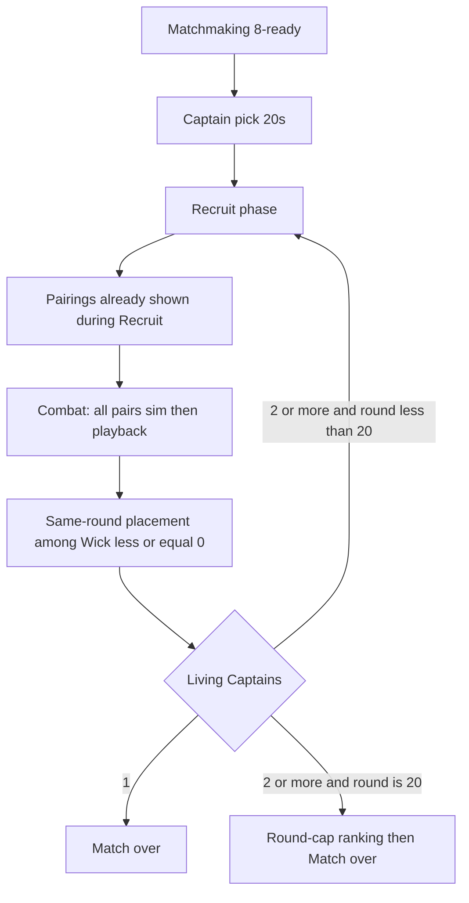
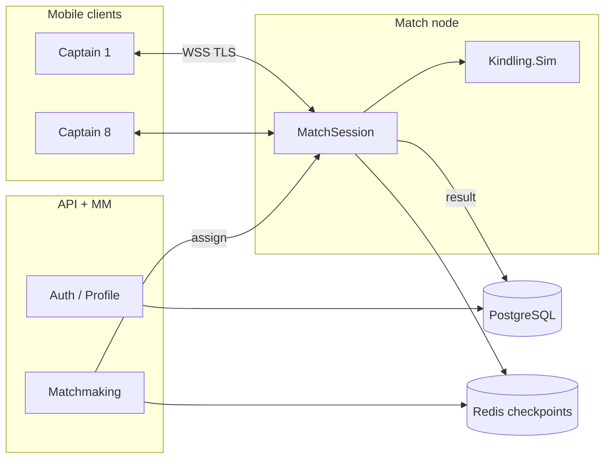

# Kindling — Design Document

| Field | Value |
|---|---|
| **Title** | Kindling: The Ember Exchange — Game Design & Technical Architecture |
| **Product** | Original-IP 8-player mobile auto-battler (iOS / Android) |
| **Working title** | **Kindling** (mode / place: **The Ember Exchange**) |
| **Author** | TBD (engineering + design) |
| **Date** | 2026-08-23 |
| **Revision** | 2 (review freeze) |
| **Status** | Draft |
| **Audience** | Senior engineers and game designers implementing from a greenfield repo |
| **Workspace note** | `C:\Users\Administrator\.grok\bin` is a tooling workspace with a fresh `git init` and **no Unity game project**. This document specifies a **new dedicated repository**. Do not implement inside the grok bin tree. |

---

## Overview

Kindling is an original-IP 8-player auto-battler for iOS and Android. Eight **Captains** gather at **The Ember Exchange**, a traveling night-market at the edge of dying worlds. Between fully automatic fights in the **Ash Ring**, they spend **Embers** to recruit **Kindled** (units) from a **shared, limited stall pool**, upgrade **Market Depth**, and assemble a seven-wide warband. Last Captain standing wins; placements 1st–8th feed Glicko-2 rating.

The design is mechanically inspired by 8-player recruit-and-auto-combat auto-battlers (economy as the primary skill axis, shared scarcity, tribe synergies, positioning, last-player-standing). Names, fiction, presentation, heroes, unit identities, and UI chrome are original. No Blizzard / Hearthstone names, art, heroes, minion names, “Bob’s Tavern,” or other protected IP. Internal analog notes stay out of store copy.

This document is the implementation source of truth. It defines a **shippable MVP vertical slice** (offline bot lobby → online 8-player) and a sequenced roadmap whose calendar **done** is **closed alpha**, not a store soft launch. A Battlegrounds-scale live catalog (~245 minions, 100+ heroes, 10 tribes, seasonal overlays) is **out of scope for v1**.

---

## Background & Motivation

### Why this game

Auto-battlers convert “deckbuilder skill under a clock” into a spectator-friendly combat payoff. Short recruit decisions compound (economy, board, positioning), then a fully automatic fight whose outcome is mostly determined but still contains readable RNG (attack targeting). Matches last 15–30 minutes — viable on mobile only if reconnect and match-node checkpointing are first-class.

### Current state of this repo

Verified 2026-08-23:

- Workspace `C:\Users\Administrator\.grok\bin` has `git init` on `master`, **zero commits**, no Unity project, no simulation library, no backend.
- A Unity Editor **6000.5.2f1** is installed at `C:\Program Files\Unity\Hub\Editor\6000.5.2f1\Editor\Unity.exe` and was previously used for an unrelated project. It is **not** this game.
- `_hero_preview/` images in the workspace are **not** Kindling assets and must not be imported.

Greenfield means every path, package, and convention below is a proposal to create, not a description of existing code.

### Pain points this architecture is designed to avoid

| Pain | Why it kills this genre | Mitigation in this doc |
|---|---|---|
| Client-trusted shop / pool | Shared scarcity is the metagame | Authoritative match server, validated recruit actions |
| Non-deterministic combat | Reconnect, replay, dispute, and bots diverge | Shared C# sim, integer math, seeded streams, combat log |
| Hardcoded class-per-unit | 50 MVP units become 200+ | Closed effect language + YAML |
| Mobile backgrounding in a 20-minute match | iOS suspends the process | Server-owned state, snapshot reconnect, Redis checkpoints |
| Match-node death | Eight players lose a run | Checkpoint every action; abort-without-MMR if resume fails |
| Seasonal rewrite | Live-ops dies if Relics fork combat | `ISeasonModule` slot |
| P2W season pass | Store rejection + community death | Cosmetics only; Ranked always 3 captain offers |
| Boiling-the-ocean content | 245-unit catalog before a playable loop | MVP: 4 Choruses, ~48 shop units, 12 captains |

---

## Goals & Non-Goals

### Goals (MVP — “First Ember”, engineering scope)

1. Playable 8-player match: captain pick → alternating Recruit / Combat → last Captain alive.
2. Authoritative economy, stall, shared pool, and combat.
3. Deterministic combat simulation with a full combat log (replay, bots, tests).
4. Touch-first landscape Unity client on iOS and Android.
5. Reconnect after app suspend / process death, mid-recruit and mid-combat-playback.
6. Match-node crash recovery via Redis checkpoint; if restore fails, abort with **no Ranked MMR**.
7. Glicko-2 rating code exists; **enabled for closed alpha**, not a store-launch gate.
8. Data-driven catalog: new unit = YAML + art bind, not a C# subclass.
9. Offline **bot lobby** (1 human + 7 heuristic bots) as the first playable vertical slice, **before** multiplayer, on a **device build**.
10. Telemetry sufficient to detect Chorus dominance, high-roll triples, AFK, node abort, ember grants.

### Non-Goals (MVP)

- Duos (4×2).
- Market Depth 7, 10 factions, 100+ captains, 200+ units.
- Seasonal overlays (Relics / Vows / Rifts / Gifts) as live content — **architecture only**.
- Public store soft launch, IAP, Battle Pass, remote Addressables as a 20-week commitment (those are **post-closed-alpha**).
- Spectate-other-fights as a product feature (debug spectator OK).
- User-generated content, trading, open world, story campaign, gacha crates that grant power.
- Cross-play with PC/console as a launch requirement (editor playmode is fine).
- Voice chat, clans, or social graph beyond friends/recent opponents.
- Perfect visual fidelity / cinematic combat.
- Blockchain, NFT, or secondary-market units.

### Later-season goals (explicitly post-MVP)

Season 1 live-ops hook, Duos, 4 more factions, captain roster expansion, battle pass cosmetics, first Relic season mechanic, localization beyond English, store soft launch.

---

## Product Identity & IP Guardrails

### Fiction (working)

After the Sundering, a traveling night-market called **The Ember Exchange** appears on the rim of dying worlds. Eight **Captains** are invited. They buy **Kindled** — living relics, beasts, and bound spirits — from **The Broker**, a masked, gender-neutral merchant who never fights. When the stall-bell rings, warbands enter the **Ash Ring** and fight without further orders. The last Captain keeps a coal of the world’s last fire. It must never be presented as a Hearthstone tavern, innkeeper, or Battlegrounds pit.

### Glossary (use these names in UI, code, and data)

| Concept | Kindling term | Code identifier |
|---|---|---|
| Player avatar | Captain | `Captain` |
| Player health | Wick | `Wick` |
| Currency | Embers | `Embers` |
| Shop | Stall | `Stall` |
| Shop progression | Market Depth | `MarketDepth` (1–6) |
| Board unit | Kindled | `Unit` |
| Triple / upgraded unit | Awakened | `Awakened` |
| Triple reward | Glimpse | `Glimpse` |
| Shop redraw | Reroll | `Reroll` |
| Keep stall | Hold | `Hold` |
| Hero power | Edict | `Edict` |
| Combat arena | Ash Ring | — |
| Host NPC | The Broker | — |
| Ranked ladder | The Crown | — |
| Faction / tribe | Chorus | `Chorus` |
| Taunt analog | Ward | `Ward` |
| Divine Shield analog | Aegis | `Aegis` |
| Reborn analog | Afterglow | `Afterglow` |
| Poison analog | Venom | `Venom` |
| Battlecry analog | Arrival | `Arrival` |
| Deathrattle analog | Echo | `Echo` |
| Start-of-combat analog | Kindle | `Kindle` |
| Magnetic analog | Latch | `Latch` |
| Permanent buff gem | Cinder | `Cinder` |
| Spell analog (post-MVP) | Charm | `Charm` |

UI, code, and catalog **always say Reroll**, never Refresh.

**Never ship:** Bob, Tavern, Battlegrounds, Hearthstone, named Blizzard heroes/minions, identical card frames, lookalike innkeeper. CI grep (PR-000) fails the build if `client/` or `content/` contains `Bob`, `Battlegrounds`, `Hearthstone`, or `Tavern` (except this design doc and `docs/IP_GUARDRAILS.md`).

Internal legal note (do not show in-game or store): “Mechanically inspired by 8-player auto-battlers; original IP. No Blizzard assets or names.” Do **not** paste patch numbers or competitor product names into store text.

### Presentation pillars

1. **Dusk marketplace, not an inn.** Lanterns, brass scales, coal, silk, iron.
2. **Readable silhouettes** at 7-wide on a phone in landscape.
3. **One primary color + a unique pattern per Chorus** (colorblind: stripe / dot / hatch / ring).
4. **Combat is a staged brawl**, not a cloned card-game attack animation.

Default art direction (overridable — see Open Questions): *painterly dusk, high-contrast silhouettes, brass + coal palette, no photoreal faces.*

---

## Game Design

### 1. Match structure

- **Mode (MVP):** Solo, 8 Captains. 8-player is load-bearing (shared pool + placement skill). See Alternatives G for 4p.
- **Win condition:** Sole survivor (`AliveCount == 1`). Draws deal 0 Ring Damage; only the combat **loser** loses Wick. Two living Captains cannot both hit 0 Wick from the same pairing (there is no mutual Wick death). The round-cap rule handles infinite draws.
- **Placement:** 1st–8th. Same-round deaths are ranked together after **all** pairs of that round resolve (see §6.2). There is no sequential “first pair processed = worse place.”
- **Duration target:** 15–25 minutes typical, 35 minutes hard cap (timers + round cap).
- **Round cap:** 20 recruit/combat cycles. If 2+ Captains remain, **every living seat gets a place** (Glicko needs 1..k). Sort living by Wick DESC, then RingDamageDealt DESC, then Recruit-snapshot `sum(atk+hp)` DESC, then `Stream.TieBreak` `Range` ASC (lower roll = worse). Assign place `1 .. livingCount`. Already-dead seats keep the places from §6.2. Do not re-rank the dead.
- **Duos:** out of MVP.



### 2. Exact numeric table (MVP locked)

These numbers are **spec, not placeholders**. Changing them after playtest is a live-config patch of the listed knobs only (`atk`/`hp`/`disabled`), not a rewrite.

| Parameter | MVP value |
|---|---|
| Lobby size | 8 |
| Starting Wick | 30 |
| Board size | **7** (dense list, indices `0 .. Count-1`, `Count ≤ 7`) |
| Hand size | **10** (dense list, indices `0 .. Count-1`, `Count ≤ 10`) |
| Stall size by Market Depth 1–6 | 3 / 3 / 4 / 4 / 5 / 6, then `+ StallSizeDelta` (Kettle-Eye: +1), **max 7** |
| Buy cost | 3 Embers (any Depth, any unit) |
| Sell reward | 1 Ember (Awakened still 1) |
| Reroll cost | 1 Ember (0 if `Flags.NextRerollFree` or Vesper’s first reroll) |
| Hold cost | 0. Reroll sets `Hold = false` (flag off) and redraws. |
| Hold limit | May Hold every turn; no charge count |
| Round-1 Embers | **3**, from the grant function. There is **no** separate starting-Embers add-on (that would make R1 = 6). |
| Ember grant | See **§2.1 GrantEmbers** + numbered **§2.2 RecruitStart/End**. Investor is StartOfRecruit YAML, not GrantEmbers. |
| Ember burn | At Recruit **end**, after EndOfRecruit effects, `Embers = 0`. PendingEmbers survive into next grant. |
| Current-Embers ceiling during Recruit | 20 (sells + Arrival gains). Not the grant cap. |
| Market Depth range | 1–6 |
| Upgrade base costs (Depth N → N+1) | 5 / 7 / 8 / 9 / 11 |
| Upgrade discount | −1 at the start of each Recruit after round 1 if the player did **not** upgrade last Recruit. Floor 0. After upgrade, cost resets to the **base** of the next Depth. |
| Round-1 upgrade | Cost is **5** with grant **3** → **illegal**. Intended. Round 2 ticks to 4 with grant 4 → can all-in. Not a bug. |
| Copy limits by Depth (shared pool) | 16 / 15 / 13 / 11 / 9 / 7. **Git-only**; not live-config hot-patchable. |
| Captain offer count | **Ranked: 3 for every seat.** Casual / offline / tutorial: 3, or 4 if free BP level ≥ 5. Never mix 3-offer and 4-offer in one Ranked lobby. |
| Captain pool (MVP) | 12. Duplicate Captains **allowed** across seats. One player’s 3 offers are drawn without replacement. |
| Captain-pick timer | 20 seconds; timeout auto-picks offer slot 0 |
| Recruit timer | See timer curve |
| Combat playback cap | **12 seconds** visual; sim is instant. `dt = min(0.20, 12 / max(N,1))` seconds per CombatEvent. Skip allowed. |
| Combat occupancy | **7 living units per side**. Summons that would exceed 7 fail closed. |
| Lifetime summons per combat | **32** additional token instances across **both** sides. Further summons fail closed (`Truncated`). This is **not** board size. |
| Death-queue depth | 64 waves; then `Truncated` |
| Glimpse offer | 3 distinct catalog ids of Depth `min(6, tripledUnit.depth + 1)` |
| Glimpse pool | **Consume one copy if `pool[id] > 0`; else grant anyway and set telemetry `glimpse_overflow`.** One rule. |
| Token Depth for Ring Damage | 1 unless catalog `tokenDamageDepth` overrides (MVP: none override) |
| Draw Ring Damage | 0 |
| Ring Damage (win) | `winner.MarketDepth + sum(living.Depth)` on the **combat** surviving board |

#### 2.1 GrantEmbers (single function)

Called from `RecruitStart` step 3. Round 1 is the first call; it **is** the opener’s 3 Embers. **Investor is not in this function** (it is a `StartOfRecruit` YAML effect, **step 6**).

```
function GrantEmbers(p, roundIndex):          # roundIndex is 1-based
  baseGrant = min(10, 2 + roundIndex)         # 3,4,...,10
  if p.CaptainId == cap_debt:
    baseGrant = min(10, baseGrant + 1)        # Debt sits inside the 10 cap
  dredger = p.DredgerBonus                    # set on Upgrade last Recruit; 0 or 2
  p.DredgerBonus = 0
  hardCap = 13 if dredger > 0 else 10
  income = min(hardCap, baseGrant + dredger)
  pending = p.PendingEmbers                   # Tally / Cashier / Sovereign
  p.PendingEmbers = 0
  p.Embers = min(20, income + pending)        # PendingEmbers are NEVER eaten by hardCap
  log metric grant_embers_total{seat} = p.Embers
```

During-Recruit gains (Scale Thief Arrival, sells, Edicts, Investor StartOfRecruit) add to `p.Embers` and are **not** passed through GrantEmbers. Clamp `p.Embers = min(20, p.Embers)` after every such gain.

**Sovereign:** EndOfRecruit action `PendingEmbersFromCounter` `{counter: RerollsThisRecruit, max: 3}` runs in `RecruitEnd` step 1, **before** burn and **before** zeroing `RerollsThisRecruit`.

#### 2.2 RecruitStart / RecruitEnd (single ordered listings)

```
function RecruitStart(match, p):          # roundIndex already incremented
  1. If roundIndex > 1:
       if p.UpgradedThisRecruit:          # last Recruit's upgrade
         # UpgradeCost was already reset to next base on the Upgrade action
         pass
       else:
         p.UpgradeCost = max(0, p.UpgradeCost - 1)
  2. p.UpgradedThisRecruit = false        # consumed for the tick; DredgerBonus is independent
  3. GrantEmbers(p, roundIndex)           # consumes DredgerBonus + PendingEmbers
  4. Fill stall under Hold rules          # Stream.Stall only
  5. CaptainPassives.OnRecruitStart(p)    # Vesper sets VesperFreeReroll
  6. Fire(StartOfRecruit)                 # Investor GainEmbers; Stream.Recruit for RandomN
  7. TryAwaken(p)

function RecruitEnd(match, p):
  1. Fire(EndOfRecruit)                   # Sovereign / Cashier read RerollsThisRecruit / BoughtThisRecruit
  2. DrainGlimpseQueue(p)                 # auto-pick remaining offers slot 0
  3. p.Embers = 0                         # burn
  4. Clear flags: NextRerollFree, TycoonFreeReroll, VesperFreeReroll, GlimpseOpen
     # NOT cleared: UpgradedThisRecruit, DredgerBonus, PendingEmbers, StallSizeDelta, LatchPlaysThisMatch
  5. p.RerollsThisRecruit = 0
     p.BoughtThisRecruit = 0
     p.Edict.UsedThisRecruit = false
```

**Flag / counter reset table**

| Field | RecruitEnd | RecruitStart | Notes |
|---|---|---|---|
| NextRerollFree, TycoonFreeReroll, VesperFreeReroll, GlimpseOpen | **clear** | Vesper re-sets VesperFreeReroll | Tycoon must not leak |
| RerollsThisRecruit, BoughtThisRecruit, Edict.UsedThisRecruit | **clear after** Fire(EndOfRecruit) | leave 0 | Sovereign reads them in step 1 |
| UpgradedThisRecruit | **keep** | consume in step 1–2, then false | skip −1 tick |
| DredgerBonus | **keep** | consumed in GrantEmbers | set on Upgrade action this Recruit, spent next GrantEmbers |
| PendingEmbers | **keep** | consumed in GrantEmbers | added after hardCap, never deleted |
| StallSizeDelta, LatchPlaysThisMatch | keep | keep | match-long |

**Dredger timing:** Upgrade action (this Recruit) sets `DredgerBonus = 2` if the captain has `DredgerNextGrantPlus2`. GrantEmbers of **this** Recruit does not see it. Next RecruitStart step 3 consumes it.

**Ember income (baseGrant only, no captain/unit mods)**

| Recruit round | baseGrant | Typical Depth |
|---|---|---|
| 1 | 3 | 1 |
| 2 | 4 | 1–2 |
| 3 | 5 | 2 |
| 4 | 6 | 2–3 |
| 5 | 7 | 3 |
| 6 | 8 | 3–4 |
| 7 | 9 | 4 |
| 8+ | 10 | 4–6 |

**Recruit timer curve** (seconds, server wall-clock)

| Round | Seconds |
|---|---|
| Captain pick | 20 |
| Recruit 1 | 45 |
| Recruit 2 | 50 |
| Recruit 3 | 55 |
| Recruit 4–5 | 60 |
| Recruit 6–7 | 75 |
| Recruit 8+ | 90 |

Client displays `serverEndUnixMs - now`. A 3s local grace after timeout is **rejected**.

### 3. Core loop (player-facing)

1. **Offer.** Ranked: three Captains. Pick one.
2. **Recruit.** Spend Embers: buy, sell, reroll, Hold, upgrade Depth, rearrange, play from hand, Edict. Pairing is shown at Recruit **start**.
3. **Lock.** Timer or Ready. If a Glimpse is open, Ready is ignored until Glimpse resolves (clock does not pause).
4. **Ash Ring.** Server simulates all pairs in ascending `pairIndex`. Combatants receive the CombatLog; others receive CombatSummary.
5. **Wick / placement.** Losers take Ring Damage. Same-round deaths get places (§6.2).
6. Repeat from 2 until one Captain remains or round 20.

**Skill axes, in priority order:** economy; Chorus commitment vs pivot; positioning; pairing adaptation; variance management.

### 4. Economy rules (authoritative)

Embers are granted by GrantEmbers and **burn at Recruit end** (after EndOfRecruit). Banking across rounds is `PendingEmbers` or board quality / Depth, never leftover coins.

| Action | Cost | Notes |
|---|---|---|
| Buy stall unit → hand or board | 3 | `destIndex` is an insert index into the **dense** list: board `0..Count` (Count means append), requiring `Count < 7` for board or `Count < 10` for hand. Visual empty slots are client-only. If both full, action illegal. |
| Sell board or hand unit | gain 1 | Returns **base** catalog copy to pool. Latch attachments destroyed, not refunded. Cinders lost. |
| Reroll | 1 (or 0) | Unbought stall units return to pool; new stall drawn; **`Hold = false`**. |
| Hold / un-Hold | 0 | `Hold=true` means those stall slots are not returned on round transition. |
| Upgrade Depth | current upgrade cost | Illegal if Depth = 6 or Embers < cost. Sets `UpgradedThisRecruit`, resets `UpgradeCost` to the next Depth’s base, Fire(OnUpgrade). If captain has `DredgerNextGrantPlus2`, sets `DredgerBonus = 2` (spent next GrantEmbers, not this one). |
| Play hand → board | 0 | Board must have space. Fires Arrival. |
| Reorder board | 0 | `board` is a permutation of `0..Count-1` for the **current** Count, not padded to 7. |
| Edict | per-Captain | Once per Recruit unless `edict.repeatable`. |
| Latch | 0 extra | See §8. One targeting rule. |
| Glimpse pick | 0 | See Glimpse timing below. |

**Illegal actions** return `{ "op":"Error", "code":..., "seq":..., "expectedStateHash":... }` and do not mutate.

#### 4.1 Fail-closed table (hand / board full)

| Situation | Result |
|---|---|
| Buy with board 7 and dest Board | `BOARD_FULL`, no mutation |
| Buy with hand 10 and dest Hand | `HAND_FULL` |
| Play with board 7 | `BOARD_FULL` |
| `AddToHand` effect (Exchange Heart, Magnet scrap, Mirror, Glimpse grant) and `Hand.Count == 10` | Effect **no-ops**; parent action still succeeds (Reroll still rerolls). Log `HandFull`. |
| Combat `Summon` and that side `Count == 7` | Summon no-ops, log `BoardFull` |
| Lifetime summons ≥ 32 | Summon no-ops, log `Truncated` |
| Afterglow and `Count == 7` | Afterglow no-ops |
| Hollow Jun Edict with `Wick <= 1` | `EDICT_ILLEGAL` (cannot suicide) |
| Glimpse offer has 0 distinct ids | grant nothing, log `GlimpseEmpty`; do not auto-pick slot 0 |

#### 4.2 Glimpse timing vs Ready (queue depth 1)

`PlayerState.GlimpseQueue` holds at most **one open offer** plus a FIFO of pending offers (Arrival Twin copying Scribe/Oracle).

- Fire(Glimpse): if `GlimpseOpen`, **enqueue**; else open this offer, set `GlimpseOpen`.
- Ready is illegal while `GlimpseOpen` (`GLIMPSE_PENDING`). Clock does **not** pause.
- On pick or auto-pick (slot 0): grant, then dequeue next if any. If the open offer has **0** ids, grant nothing, log `GlimpseEmpty`, clear `GlimpseOpen`, dequeue next.
- RecruitEnd step 2 auto-picks every remaining queued offer (empty offer → `GlimpseEmpty`, no grant).
- Pick window for the open offer is `min(8s, timeRemaining)`; queued offers auto-pick immediately when they become open after RecruitEnd, or get the remaining window if still in Recruit.

### 5. Stall, shared pool, Hold, Awaken, Glimpse

**Pool structure (determinism):** `List<PoolEntry>` sorted by `UnitId.Value` ascending. `PoolEntry { UnitId Id; int Remaining; }`. Never iterate a `Dictionary` for draws or hashes.

**Generation (copy-weighted, Stream.Stall only).** At Recruit start (and on Reroll), fill stall to `min(7, stallSize(depth) + StallSizeDelta)`:

```
eligible = pool entries with catalog.depth <= player.Depth and Remaining > 0
           (already sorted by UnitId)
repeat stallSize times:
  total = sum(e.Remaining for e in eligible)
  if total == 0: stop (stall may be short; never invent copies)
  r = rng.Range(Stream.Stall, 0, total)      # Stream.Stall — the ONLY Stall consumer
  walk eligible in id order; subtract Remaining until r < row.Remaining
  pick that row; Remaining--; append catalog id to stall
```

Weight equals remaining copies, not unit types. **Golden:** pool `{A:1, B:99}` both Depth-legal → over 10_000 seeded draws, `count(B) / 10000` is within 1% of 0.99 (e.g. seed 1 → fixture JSON). Equivalent bag: ids with multiplicity `Remaining`, draw without replacement.

Glimpse **offers** stay **uniform over distinct ids** (`Stream.Glimpse`), not copy-weighted.

**Match start:** each shop-legal unit gets `Remaining = copyLimit(depth)` (YAML override allowed; live-config cannot change copy_limit).

**Ownership**

- In stall: out of pool.
- Held: stay out of pool.
- Bought: out of pool until sold.
- Sold: `Remaining++` on the **base** catalog id (Awakened sells as base, one copy).
- Combat deaths do not return copies.

**Round boundary**

- `Hold == true`: kept slots stay; empty slots refill at new Depth. Hold flag remains until the player un-Holds or Rerolls (`Hold = false`).
- `Hold == false`: entire stall returns to pool, then a full stall is drawn.

**Awaken (triples)**

- Key: base `catalogId` (Awakened counts as the same id).
- Count: **board + hand only**. Stall units are never owned and **do not count**.
- When owned count ≥ 3: consume the three left-most in board-then-hand order; create one Awakened on the board if `Count < 7`, else hand if `Count < 10`, else the Awaken **waits** (`AwakenPending`, retry after sell/play).
- Stats (**Cinders are not applied a second time**):
  ```
  ExtraAtk = sum(three.ExtraAtk)     # already includes prior GiveCinder
  ExtraHp  = sum(three.ExtraHp)
  Cinders  = sum(three.Cinders)      # bookkeeping for future GiveCinder ONLY
  Atk = 2*baseAtk + ExtraAtk         # do NOT add Cinders again
  Hp  = 2*baseHp  + ExtraHp
  ```
  `GiveCinder(n)` does `Cinders += n; ExtraAtk += n; ExtraHp += n`. Effective combat atk is `Atk`, never `Atk + Cinders`. **Golden:** Smelter ×3 (each Extra 2/2, Cinders 2) → Awaken ExtraAtk=6, Cinders=6, Atk=`2*base+6` (not `2*base+12`).
- Keywords = union (Flags OR). Then enqueue Glimpse.
- `awakenedEffects` replace `effects` if present; else effects unchanged.
- Ninth Candle: after the body is built, `ExtraAtk += 2; ExtraHp += 2; Atk += 2; Hp += 2`.

**Pool invariants (split; PR-005/PR-036 fixtures)**

Shop-legal copies (tokens never enter this equation):

```
sum_id (Remaining[id] + stallShop[id] + ownedShop[id])
  + 2 * AwakenEvents
  + ShopLatchDestroyed
  == StartCopies + GlimpseOverflowGrants + MirrorGrants + AddToHandFromPoolOverflow
```

- `ownedShop`: Awakened counts as **1**. Tokens and Latch-token scraps are excluded.
- `AwakenEvents`: each triple destroys 2 owned copies that do not return to Remaining.
- `ShopLatchDestroyed`: shop-legal units consumed by Latch (not Magnet air-tokens).
- `GlimpseOverflowGrants` / `MirrorGrants` / `AddToHandFromPoolOverflow`: owned created with no `Remaining--`.

Tokens: `TokenSpawned` vs `TokenDestroyed` is a separate counter. Magnet air-Latch, Mere scrap, Echo motes, Grubs are tokens. Fixture: one Awaken + one Mirror Arrival.

**Glimpse (one rule)**

1. Build candidate ids: shop-legal, Depth `== min(6, unit.depth+1)`, `Remaining > 0`, distinct. If fewer than 3, fill from Depth `≤` that, still in pool, id order, `Stream.Glimpse`.
2. If **0** distinct ids remain after fill: do **not** open a Glimpse UI; grant nothing; log `GlimpseEmpty`. Auto-pick slot 0 is illegal on an empty offer.
3. Otherwise offer up to 3. Player picks. Consume `Remaining--` if `Remaining > 0` after pick; if already 0, still grant and emit `glimpse_overflow`.
4. Grant is a **base catalog instance** into hand (fail-closed if hand full).

### 6. Pairings, ghosts, placement

#### 6.1 Berger pairing (the only algorithm)

Join order is seats `0..7` assigned at lobby create (stable). Pairing uses **no RNG**. `Stream.Pair` exists in the enum for compatibility and is **unused** in MVP.

```
function Pair(livingSeats, round):
  # livingSeats: join-order of seats with Wick > 0, holes removed. No RNG.
  L = livingSeats in original join order
  n = L.length
  if n <= 1: return no pairs
  work = copy L
  if n % 2 == 1:
    work.append(BYE)            # virtual seat; rotating bye, NOT "last index always ghosts"
    n = n + 1
  rot = (round - 1) % (n - 1)
  circle = [work[0]] + rotateRight(work[1..], rot)
  # rotateRight(arr, k): last k elements move to the front.
  # Example: rotateRight([1,2,3,4,5,6,BYE], 1) == [BYE,1,2,3,4,5,6]
  # The n=7 ghost table below is this direction; rotateLeft is a different pairing and is forbidden.
  pairs = []; ghost = null
  for i in 0 .. n/2 - 1:
    a = circle[i]; b = circle[n-1-i]
    if a == BYE: ghost = b; continue
    if b == BYE: ghost = a; continue
    pairs.append((min(a,b), max(a,b)))
  sort pairs by (first seat, second seat)
  return pairs, ghost
```

**Worked n=8, round 1** (no BYE, rot=0): seats `[0,1,2,3,4,5,6,7]` → pairs `(0,7),(1,6),(2,5),(3,4)`; no ghost.

**Worked n=7 bye table** (living `[0,1,2,3,4,5,6]`; each seat ghosts exactly once in 7 rounds):

| Round | rot | ghost |
|---|---|---|
| 1 | 0 | 0 |
| 2 | 1 | 5 |
| 3 | 2 | 3 |
| 4 | 3 | 1 |
| 5 | 4 | 6 |
| 6 | 5 | 4 |
| 7 | 6 | 2 |

Fixture: over rounds 1–7, `max(ghostCounts) - min(ghostCounts) ≤ 1`. Not always seat 6.

**Ghost (Ash Echo):** the unpaired living seat fights a ghost board.

- Source: most recently eliminated Captain’s last **Recruit snapshot** board (the board they locked the round they died). If several died the same round, the one with the **worst place** among that round (already assigned) is “most recent”; if still tied, lowest seat index.
- If no one has died yet (defensive only): three `tok_dummy` 2/2.
- Ghost Depth for Ring Damage = the eliminated Captain’s Market Depth at death.
- Ghost Wick is infinite. A loss vs ghost still damages the living Captain. Ghost is not a player.

**Matchup UI:** `display_name`, Wick, Depth, pairing arrow. Opponent board hidden. Show opponent Depth + Chorus tags.

**Combat resolution order:** simulate pairs in **ascending pairIndex**, then ghost pair last (`pairIndex = pairs.length`). This order does **not** affect placement (placement waits for all results).

#### 6.2 Same-round placement

After every pair (and ghost) of the round has a `CombatResult` and Wick is applied:

```
newlyDead = seats that were alive at round start and now Wick <= 0
# Wick may be negative (overkill). Alive players are Wick > 0.

sort newlyDead by:
  1. Wick ASC          # more negative = worse
  2. RingDamageTaken this combat DESC
  3. RingDamageDealt this combat ASC
  4. Stream.TieBreak Range(0, 2^31) per seat (lower roll = worse)

livingAfter = count of seats with Wick > 0
# worst of newlyDead gets place = livingAfter + newlyDead.length
# next gets one better, ...
# best of newlyDead gets place = livingAfter + 1

for i, seat in enumerate(sorted newlyDead):      # i=0 is worst
  seat.Place = livingAfter + (newlyDead.length - i)
```

Example: 8 alive, 3 die: places 8, 7, 6 assigned worst→best; 5 remain. Two pairs producing two deaths in the same round is the **normal** case and is fully specified here.

Abandon mid-match: the leaver is treated as newlyDead with Wick = −999, RingDamageTaken = ∞, so they take the **current last place among remaining including self** (5 alive + abandon → place 5). Glicko uses that place. Not always 8th.

**Round-cap (living places):** see §1. After round 20 combat and §6.2 deaths, sort remaining living and assign `1..livingCount`. Dead seats keep prior places.

### 7. Combat rules (single algorithm)

Combat is a pure function. There are **no prose alternatives** in this section.

```
CombatResult CombatSim.Run(PlayerState a, PlayerState b, MatchRng rng, Catalog cat)
# Production and goldens use the LIVE MatchRng. Stream.Combat is consumed and EVOLVES.
# Do NOT reseed per pair or per round. pairIndex is CombatLog / CombatSummary metadata only
#   (ghost pair uses pairs.length). Simulation order is still ascending pairIndex so the
#   evolving Combat stream is well-defined across the round.
# Ghost: construct a fake PlayerState { Wick = int.MaxValue, Depth = depthAtDeath,
#   Board = last Recruit snapshot, Seat = -1 }. Infinite Wick; Ring Damage uses Depth.
# Deep-copy boards. Combat-only modifiers die with the copy.
# Occupancy cap = 7 per side. LifetimeSummonCount starts at 0 (both sides share the 32 cap).
# Goldens: var rng = new MatchRng(fixtureSeed); Run(a, b, rng, cat);
#   (a fresh MatchRng from fixtureSeed — not a per-pair FNV reseed of a live match rng).
```

`Fire` **never** calls `DrainDeaths` and **never** calls `AuraRefresh`. Drain callers: `Run` after each `KindleSide`, `Run` after each `ResolveAttack`, and the `DrainDeaths` while-loop (next wave). AuraRefresh callers: `Run` at combat start and `Run` after **every** `DrainDeaths` (both Kindle drains and each attack drain). Re-entrant `DrainDeaths` while `InDrain==true` is a sim assert / no-op.

Recruit snapshots are restored after combat. Persisted to the player: Wick, last combat board (ghost source), telemetry. Cinders / Latch / Permanent extras live on the Recruit snapshot because they were applied in Recruit. Kindle “ThisCombat” buffs do not.

#### 7.1 RNG call table (Combat stream, numbered)

**No per-combat reseed.** `Stream.Combat` is seeded **once** at match create (Technical §5: `FNV1a64(MatchId || Salt || Stream || 0 || 0)`). `Run` only calls `rng.Bit(Stream.Combat)` / `rng.Range(Stream.Combat, …)` and the PCG **evolves**. `round` and `pairIndex` are **not** seed inputs. Isolated goldens construct `new MatchRng(fixtureSeed)` then `Run(..., rng, cat)`.

| # | When | Call |
|---|---|---|
| C1 | Counts equal for FirstStriker | `rng.Bit(Stream.Combat)` → true means A |
| C2 | Each Kindle/Echo/OnAttack `RandomN` / random enemy | `rng.Range(Stream.Combat, 0, candidates.Count)` |
| C3 | Each attack, target pick | `rng.Range(Stream.Combat, 0, valid.Count)` |
| C4 | `ab_harrow` random graveyard pick | `rng.Range(Stream.Combat, 0, graveyard.Count)` |

`Stream.TieBreak` is **not** used inside Run (only placement / round-cap). `Stream.Stall` is **never** used in combat **or** in recruit RandomN (stall slot draws only). `Stream.Recruit` is never used in combat.

`MatchRng` combat methods: `Range(Stream.Combat, minInclusive, maxExclusive)`, `Bit(Stream.Combat)`, `Shuffle(Stream.Combat, list)`. There is **no** `Draw()`.

#### 7.2 Simulate (pseudocode)

```
function Run(pa, pb, rng):                 # PlayerState clones; boards on pa.Board / pb.Board
  # rng is the live MatchRng. All draws: Stream.Combat. No reseed.
  A = pa.Board; B = pb.Board
  dense pack; strip ThisCombat modifiers
  for each unit: AttacksThisCombat=0; AttackCharges=1; AfterglowConsumed remains
  LifetimeSummons = 0; DeathWaves = 0; InDrain = false
  Graveyard = []   # {unit snapshot, seat, order}

  if A.Count > B.Count: first, second, firstP, secondP = A, B, pa, pb
  else if B.Count > A.Count: first, second, firstP, secondP = B, A, pb, pa
  else: # C1
    if rng.Bit(Stream.Combat): first, second, firstP, secondP = A, B, pa, pb
    else:                      first, second, firstP, secondP = B, A, pb, pa

  AuraRefresh(A); AuraRefresh(B)

  KindleSide(first);  DrainDeaths(); AuraRefresh(A); AuraRefresh(B)
  KindleSide(second); DrainDeaths(); AuraRefresh(A); AuraRefresh(B)
  # Golden: Throne (aura) + Spark Bit Kindle kill (or 1-hp aura token) → adjacent
  # fromAura stats are gone BEFORE the first attack.

  attackerSide, defenderSide = first, second
  attackerP, defenderP = firstP, secondP
  while A.Count > 0 and B.Count > 0:
    atk = LeftmostEligible(attackerSide)
    if atk is null:
      atk = LeftmostEligible(defenderSide)
      if atk is null: break
      swap attackerSide, defenderSide; swap attackerP, defenderP
    valid = Wards(defenderSide) if any Ward else all living on defenderSide
    target = valid[rng.Range(Stream.Combat, 0, valid.Count)]               # C3
    ResolveAttack(atk, target)
    atk.AttacksThisCombat += 1
    DrainDeaths()
    AuraRefresh(A); AuraRefresh(B)           # after EVERY DrainDeaths
    swap attackerSide, defenderSide; swap attackerP, defenderP

  if A.Count==0 and B.Count==0: return Draw, 0
  if A.Count==0: return B wins, RingDamage(pb)
  if B.Count==0: return A wins, RingDamage(pa)
  return Draw, 0

function LeftmostEligible(side):
  for i in 0 .. side.Count-1:
    u = side[i]
    if u.Atk > 0 and u.AttacksThisCombat < u.AttackCharges: return u
  return null

function RingDamage(winnerPlayer):
  return winnerPlayer.Depth + sum(u.Depth for u in winnerPlayer.Board)

function ResolveAttack(attacker, defender):
  Fire(OnAttack, attacker)                 # does NOT drain
  ApplyDamage(attacker, defender, attacker.Atk)
  ApplyDamage(defender, attacker, defender.Atk)
  # DrainDeaths is the caller's job, once

function ApplyDamage(source, target, amount):
  if amount <= 0: return
  if target.Has(Aegis):
    target.Remove(Aegis); log AegisBreak; return
  wasAlive = target.Hp > 0
  target.Hp -= amount
  if source.Has(Venom) and amount > 0:
    target.Hp = 0
    log VenomKill
    Fire(OnVenomKill, source, target)      # does NOT drain
  Fire(OnDamageDealt, source); Fire(OnDamaged, target)
  if wasAlive and target.Hp <= 0:
    Fire(OnKill, source, target)           # lethal unshielded; does NOT drain

function KindleSide(side):
  snapshot = copy of current units L→R at start of this side's Kindle
  for u in snapshot:
    if u still on board and u has Kindle: Fire(Kindle, u)
  # DrainDeaths is the caller's job, once per side
```

**Attacker model chosen:** **leftmost unused charges**, a pure function of board state. Rejected: BG-style stored next-attacker pointer (Afterglow/summon insert would skip or double-hit depending on hidden index). See Alternatives H.

#### 7.3 DrainDeaths (occupancy, Afterglow, Echo)

```
function DrainDeaths():
  if InDrain: return                       # non-reentrant; Fire must never call this
  InDrain = true
  try:
    while true:
      dying = [u for u in concat(A,B) if u.Hp <= 0 and not u.DeathProcessed]
      dying.sort by (seat==first?0:1, slotIndex)
      if dying empty: return
      DeathWaves += 1
      if DeathWaves > 64:
        log Truncated; mark remaining hp<=0 DeathProcessed; Compact(A); Compact(B); return

      afterglowQueue = []
      for u in dying:
        u.DeathProcessed = true
        Graveyard.append(snapshot of u)
        if u.Has(Afterglow) and not u.AfterglowConsumed:
          afterglowQueue.append({u.side, u.slotIndex, u})
        RemoveFromBoard(u.side, u)
      Compact(A); Compact(B)

      # Echo L→R. Nested hp<=0 wait for the NEXT while-iteration. Fire does not drain.
      for u in dying:
        Fire(Echo, u)

      for rec in afterglowQueue:
        if rec.side.Count >= 7: log BoardFull; continue
        neu = NewInstance(rec.unit.CatalogId)
        neu.Atk = 1; neu.Hp = 1; neu.MaxHp = 1
        neu.Keywords = empty unless catalog.afterglowKeepsKeywords  # MVP: false
        neu.AfterglowConsumed = true
        neu.AttacksThisCombat = 0
        neu.AttackCharges = 1
        neu.Cinders = 0; neu.Latches = []
        rec.side.Insert(min(rec.originalIndex, rec.side.Count), neu)
  finally:
    InDrain = false
```

**Golden:** Ash Choir Echo on a board of 7 (including Choir): extract Choir → occupancy 6 → Echo two motes (fill to 7) → Afterglow of Choir no-ops (`BoardFull`). Fixed seed. Fire must not drain mid-Echo or Afterglow would interleave with the second mote.

**Afterglow (locked):** new combat instance; `AfterglowConsumed = true`; `AttacksThisCombat = 0`; `AttackCharges = 1`; 1/1; once per instance. It **will** attack when its side next has no earlier unused-charge unit (leftmost unused scan).

**Summon insert:** default **append rightmost** if `Count < 7` and `LifetimeSummons < 32`. `LifetimeSummons++` per successful token. Catalog `summonPosition: LeftmostHole` is not used in MVP.

`ab_night` Echo is action `SummonFill` `{unit: tok_ash_mote, atk:2, hp:2}` (grants Afterglow via token catalog). Fills until occupancy 7 or lifetime 32.

`ab_harrow` Echo is action `SummonFromGraveyard` `{count:2, atk:1, hp:1}` with filter friendly+hasEcho+excludeSelf. Picks with Combat C4 `Range` on the Graveyard list (died this combat before this Echo; earlier waves included; self excluded). Fail closed if none. No magic unit ids.

#### 7.4 ApplyDamage / keywords in combat

Unchanged from the functions above. Overkill allowed. 0-atk units never attack.

#### 7.5 Positioning

Sim board is a **dense** list. Slot 0 is leftmost. Client may draw empty frames; they are not sim slots. Reorder permutes current Count.

#### 7.6 Combat log

Every public step is a `CombatEvent` (schema in Technical §7). Production clients **play the log**; they do not resimulate. Sim is linked into the client for Editor replay, goldens, and own-Edict prediction during Recruit.

---

### 8. Keywords (MVP set — frozen)

No additional keywords in MVP. New text composes from these + the closed action set.

| Keyword | Code | Rules |
|---|---|---|
| **Ward** | `Ward` | If any Ward is alive on a side, attacks must target a Ward. |
| **Aegis** | `Aegis` | First damaging instance absorbed. 0-damage does not break it. Venom does not apply through Aegis. Recruit-granted Aegis lives on the snapshot. |
| **Afterglow** | `Afterglow` | On death, once per instance, as §7.3. |
| **Venom** | `Venom` | If this deals >0 unshielded damage, target Hp = 0. |
| **Arrival** | `Arrival` | On play from hand **or** stall-to-board during Recruit. Combat summons do **not** fire Arrival unless the Summon action has `fireArrival: true`. |
| **Echo** | `Echo` | On death in combat. On sell only if catalog `echoOnSell: true` (MVP default false). Extra Echo from Echoist is a second Fire(Echo) immediately after the first, same wave. |
| **Kindle** | `Kindle` | Start of combat, once per combat instance. |
| **Latch** | `Latch` | Modular attach. See the single targeting rule. |

**Latch — one targeting sentence.** A Latch unit in **hand** may be attached to **any** legal host on the board; a Latch unit **on the board** may be attached only to an **adjacent** legal host. Default host filter: `host.Chorus == Gearwights`, unless the Latch catalog sets `latchHost: Any`. Consume the Latch unit; add its Atk/Hp to the host; union keywords (Flags OR); if `latchTransferEffects: true` (MVP default true), append the Latch unit’s Echo/Kindle effects onto the host for this match.

From stall: Buy then Latch are two actions.

**Godgear bonus (integer, catalog field not a host-id hook):** `gw_godgear` YAML sets `onLatched: { statMulN: 3, statMulD: 2 }`. When any Latch attaches to a host with that field, host gains `latch.Atk * N / D` and `latch.Hp * N / D` (floor) **instead of** raw latch stats — 3/2 = 150% of the **Latch body**. Example: 4/4 Latch → host +6/+6. Default `onLatched` is `{statMulN:1, statMulD:1}`.

Awakened Latch: the consumed body’s stats are the Awakened stats (then multiplied by host `onLatched`).

**Cinder:** `GiveCinder(n)` does `Cinders += n; ExtraAtk += n; ExtraHp += n`. Combat atk is `Atk` (`base + ExtraAtk`), **never** `Atk + Cinders`. Awaken copies summed Extra* and summed Cinders as bookkeeping only (§5).

**Not in MVP:** Gale (extra attack), Ranged, Cleave, stealth, immune, Charm loops. Double-Echo is `echoTimes` / Echoist, not a keyword.

### 9. Choruses (factions)

MVP ships **four** Choruses + Neutrals. Four more names are reserved.

| Chorus | Color / pattern | Identity | Internal analog (docs only) |
|---|---|---|---|
| **Cinderkin** | Copper / stripe | Economy / stall-cycle | Shop-cycle |
| **Gearwights** | Brass / ring | Modular Latch bodies | Magnetic |
| **Ashbound** | Violet / hatch | Echo / Afterglow recursion | Deathrattle + reborn |
| **Gutterlings** | Sickle-green / dot | Venom, tokens, scam | Poison swarm |

Post-MVP reserved: **Leywyrms** (Kindle scaling), **Thornkin** (self-Wick), **Spellweirs** (Charm engines), **Runebeasts** (Cinder plan). Do not implement units in MVP.

### 10. MVP catalog — Captains (12)

All active Edicts are once per Recruit. `cost` is Embers. Duplicate Captains **are allowed** across the lobby.

| Id | Name | Wick | Edict / passive | Role |
|---|---|---|---|---|
| `cap_vesper` | Captain Vesper | 30 | Passive: first Reroll each Recruit costs 0 (`Flags.VesperFreeReroll`). | Cinderkin |
| `cap_mere` | Iron Mere | 30 | Cost 1: `AddToHand` `tok_scrap` (2/1 Latch). | Gearwight |
| `cap_widow` | Widow Ash | 30 | Cost 1: target friendly unit GrantKeyword Echo + attached `Summon tok_ash_mote`. | Ashbound |
| `cap_skiv` | Skiv the Gutter | 30 | Passive: OnBuy, if bought unit Chorus==Gutterlings, BuffStats +1 Atk Permanent on that unit. | Gutterling |
| `cap_debt` | Ledger of Debt | 25 | Passive: inside GrantEmbers (see §2.1). | Economy |
| `cap_sable` | Sable Coil | 30 | Cost 2: Glimpse at **current** Depth (not +1). | Value |
| `cap_jun` | **Hollow Jun** | 30 | Cost 0 once: if Wick > 1, Wick -= 1, BuffStats +1/+1 Permanent on target. Illegal at Wick==1. | Tempo |
| `cap_rhee` | Quartermaster Rhee | 30 | Cost 1: Reroll then `Hold=true`. | Stall control |
| `cap_glass` | Glass Saint | 30 | Passive Kindle: leftmost friendly gains Aegis ThisCombat. | Defensive |
| `cap_dredger` | Dredger Mo | 30 | Named passive `DredgerNextGrantPlus2` only (no edict). OnUpgrade sets `DredgerBonus=2` for **next** GrantEmbers. | Scaling |
| `cap_kettle` | Kettle-Eye | 30 | Passive: `StallSizeDelta += 1` (max stall 7). | Shop |
| `cap_candle` | Ninth Candle | 30 | Passive: on Awaken, +2/+2 Permanent on the Awakened body. | Triple |

Captain pick: per seat, 3 uniform without replacement from 12. Ranked never adds a 4th. Casual 4th is post-closed-alpha BP content.

Hollow Jun vs tutorial: tutorial still floors Wick at 1; the Edict is already illegal at 1 so they cannot self-eliminate.

### 11. MVP catalog — shop units (~48) + tokens

Depth mix: 10 / 10 / 8 / 8 / 6 / 6 = 48 shop units. Tokens are not pooled.

Stats are **base**. Designers edit YAML; engineers do not hardcode stats. English text below is the design intent; **the YAML is canonical** once PR-004/011b/012 land. Cards that needed a closed-language reading are specified in §11.1 and in the worked YAML (§Effect).

#### Depth 1 (10)

| Id | Name | Chorus | Atk/Hp | Text |
|---|---|---|---|---|
| `ck_urchin` | Coal Urchin | Cinderkin | 2/1 | Arrival: next Reroll this Recruit costs 0. |
| `ck_tally` | Tally Rat | Cinderkin | 1/2 | Echo: `PendingEmbers += 1` (**persist Player**). |
| `gw_cog` | Cogling | Gearwights | 2/2 | Latch. |
| `gw_washer` | Washer | Gearwights | 1/3 | Latch. Ward. |
| `ab_cinderling` | Cinderling | Ashbound | 2/1 | Afterglow. |
| `ab_bell` | Grave Bell | Ashbound | 1/2 | Echo: Summon `tok_ash_mote`. |
| `gt_skulk` | Skulker | Gutterlings | 2/1 | Venom. |
| `gt_grub` | Grub | Gutterlings | 1/1 | Arrival: Summon `tok_grub` if board space. |
| `ne_warden` | Gate Warden | Neutral | 1/4 | Ward. |
| `ne_porter` | Porter | Neutral | 2/2 | Arrival: +1/+1 Permanent to a random friendly. |

#### Depth 2 (10)

| Id | Name | Chorus | Atk/Hp | Text |
|---|---|---|---|---|
| `ck_brokerling` | Brokerling | Cinderkin | 3/3 | OnReroll: self +1/+1 Permanent. |
| `ck_scale` | Scale Thief | Cinderkin | 2/3 | Arrival: if Embers ≥ 6 **after** paying the buy, GainEmbers 1. |
| `gw_rivet` | Rivet Host | Gearwights | 3/4 | OnLatch (this is host): GrantKeyword Aegis Permanent. |
| `gw_spark` | Spark Bit | Gearwights | 2/2 | Latch. Kindle: DealDamage 1 random enemy. |
| `ab_urn` | Urn Kin | Ashbound | 3/2 | Echo: +2/+2 Permanent to a random **combat-copy** friendly (does **not** persist to Recruit). |
| `ab_veil` | Veil Walker | Ashbound | 2/3 | Afterglow. Echo: Summon `tok_ash_mote`. |
| `gt_needle` | Needle Fin | Gutterlings | 3/1 | Venom. Arrival: +1 Atk Permanent to another Gutterling. |
| `gt_tide` | Tide Peck | Gutterlings | 2/4 | OnBuy (any Gutterling): self +1/+1 Permanent. |
| `ne_scribe` | Stall Scribe | Neutral | 2/3 | Arrival: Glimpse Depth 1 (fixed). |
| `ne_lantern` | Lantern | Neutral | 3/3 | Kindle: adjacent +1 Atk ThisCombat. |

#### Depth 3 (8)

| Id | Name | Chorus | Atk/Hp | Text |
|---|---|---|---|---|
| `ck_cashier` | Ember Cashier | Cinderkin | 3/4 | EndOfRecruit: if `BoughtThisRecruit >= 2`, `PendingEmbers += 1`. |
| `ck_barker` | Barker | Cinderkin | 4/4 | OnReroll: +1/+1 Permanent to a random friendly Cinderkin. |
| `gw_chassis` | Chassis | Gearwights | 4/6 | Ward. OnLatch (you played a Latch): self +1/+1 Permanent. |
| `gw_magnet` | Magnet Monk | Gearwights | 3/3 | Arrival: AttachLatch a 2/2 Cogling token onto self (no pool). |
| `ab_choir` | Ash Choir | Ashbound | 3/4 | Echo: Summon two `tok_ash_mote`. Afterglow. |
| `gt_duke` | Gutter Duke | Gutterlings | 4/3 | Venom. Kindle: GrantKeyword Venom ThisCombat to a random other Gutterling. |
| `ne_echoist` | Echoist | Neutral | 3/4 | Aura: `SetEchoTimesBonus` amount=1. Dispatcher Echo count = `1 + sum(bonuses)` on the side. YAML `echoTimes` stays default 1. Afterglow is not Echo. |
| `ne_wall` | Market Wall | Neutral | 2/8 | Ward. |

#### Depth 4 (8)

| Id | Name | Chorus | Atk/Hp | Text |
|---|---|---|---|---|
| `ck_tycoon` | Coal Tycoon | Cinderkin | 5/5 | OnBuy: SetFlag `TycoonFreeReroll` Once ThisRecruit; next Reroll costs 0. |
| `gw_coloss` | Coloss Frame | Gearwights | 6/8 | Ward. Arrival: `BuffStatsScaled` `{counter: LatchPlaysThisMatch, atk:2, hp:2, duration: Permanent}`. |
| `ab_pyre` | Pyre Saint | Ashbound | 4/6 | Echo: Summon `tok_ash_mote_aw`. Kindle: GrantKeyword Afterglow ThisCombat to a random friendly. |
| `gt_queen` | Needle Queen | Gutterlings | 5/4 | Venom. OnVenomKill (friendly source): self +2/+1 Permanent, `persist: Player` (keeps across combats). |
| `ne_doubler` | Arrival Twin | Neutral | 4/4 | Arrival: copy another friendly unit’s Arrival this Recruit, **target chosen**, once. No legal target → no-op. Cannot self-target. Copying a Glimpse Arrival fires Glimpse again. |
| `ne_smelter` | Smelter | Neutral | 3/5 | Arrival: GiveCinder 2 to target unit. |
| `ck_investor` | Investor | Cinderkin | 4/4 | StartOfRecruit, `when: DepthGte 4`: GainEmbers 1. **Not** a GrantEmbers special case. |
| `gw_kit` | Field Kit | Gearwights | 2/2 | Latch. On attach: host Aegis + +3/+3 Permanent. |

#### Depth 5 (6)

| Id | Name | Chorus | Atk/Hp | Text |
|---|---|---|---|---|
| `ck_exchange` | Exchange Heart | Cinderkin | 6/6 | OnReroll: `AddToHandFromPool` chorus=cinderkin depthMax=3 consume=true. RandomN uses **Stream.Recruit**. HandFull → skip add. |
| `gw_throne` | Iron Throne | Gearwights | 7/10 | Ward. Aura: adjacent +2/+2. |
| `ab_harrow` | Harrower | Ashbound | 6/6 | Echo: `SummonFromGraveyard` count=2 atk=1 hp=1, filter friendly+hasEcho. |
| `gt_bloom` | Venom Bloom | Gutterlings | 6/5 | Venom. Kindle: all friendly Gutterlings +2 Atk ThisCombat. |
| `ne_oracle` | Oracle | Neutral | 5/5 | Arrival: Glimpse current Depth. |
| `ne_aegis_choir` | Aegis Choir | Neutral | 4/7 | Kindle: all friendly Aegis ThisCombat. |

#### Depth 6 (6)

| Id | Name | Chorus | Atk/Hp | Text |
|---|---|---|---|---|
| `ck_sovereign` | Ember Sovereign | Cinderkin | 8/8 | EndOfRecruit: `PendingEmbersFromCounter` `{counter: RerollsThisRecruit, max: 3}` before burn. |
| `gw_godgear` | Godgear | Gearwights | 8/12 | Ward. Afterglow. `onLatched: {statMulN: 3, statMulD: 2}`. |
| `ab_night` | Night of Ash | Ashbound | 7/7 | Echo: `SummonFill` `tok_ash_mote` (2/2 Afterglow) until occupancy 7. |
| `gt_hydra` | Gutter Hydra | Gutterlings | 7/7 | Venom. Afterglow. Echo: two `tok_venom_grub`. |
| `ne_crown` | Crown of Cinders | Neutral | 6/8 | Arrival: GiveCinder 2 to all friendly. |
| `ne_mirror` | Mirror Broker | Neutral | 6/6 | Arrival: `CopyOwnedToHand` `{shopLegalOnly: true, baseCatalog: true, consumePool: false}`. Stream.Recruit. HandFull → no-op. |

#### Tokens (not in pool)

| Id | Name | Atk/Hp | Notes |
|---|---|---|---|
| `tok_ash_mote` | Ash Mote | 1/1 | Depth 1 |
| `tok_ash_mote_aw` | Ash Mote Awakened | 2/2 | Depth 1 |
| `tok_grub` | Grub Token | 1/1 | |
| `tok_venom_grub` | Venom Grub | 2/2 | Venom |
| `tok_cog_latch` | Cogling Latch | 2/2 | Latch |
| `tok_scrap` | Scrap | 2/1 | Latch (Mere) |
| `tok_dummy` | Cinder Dummy | 2/2 | Ghost fallback |

#### 11.1 Persist table (Player vs CombatCopy)

Combat runs on a deep copy that is discarded. An action mutates the Recruit `PlayerState` only if `persist: Player`. Default persist by trigger:

| Trigger family | Default persist | Example |
|---|---|---|
| Arrival, OnBuy, OnSell, OnReroll, OnLatch, OnUpgrade, OnAwaken, StartOfRecruit, EndOfRecruit | **Player** | Brokerling +1/+1 keeps |
| Kindle, OnAttack, OnKill, OnDamaged, OnDamageDealt, Aura (combat) | **CombatCopy** | Lantern +1 Atk this combat |
| Echo | **CombatCopy** | Urn Kin +2/+2 is in-fight only |
| Echo with explicit `persist: Player` | **Player** | Tally Rat PendingEmbers; Needle Queen +2/+1 |
| Afterglow / Summon | CombatCopy instance | Tokens vanish after combat (not on Recruit board) |

Granting a keyword or Cinder during Recruit is Player. Granting Aegis during Kindle is CombatCopy.

This roster is the **v0.1 balance sheet**.

### 12. Seasonal layer (architecture now, content later)

```
interface ISeasonModule {
  string Id { get; }            // "none", "relics_s1"
  void OnMatchStart(MatchState m);
  void OnRecruitStart(PlayerState p);
  void OnCombatStart(CombatCtx c);
  IEnumerable<Offer> ExtraOffers(PlayerState p);
  void ValidateAction(PlayerState p, Action a);
}
```

MVP ships `SeasonNone`. Post-MVP modules inject offers and triggers through the **same** effect pipeline.

| Season | Hook |
|---|---|
| S0 / MVP | None |
| S1 Relics | At Depth 2 and 4, Glimpse a Relic (`type: relic`) |
| S2 Vows | Quest progress in-match |
| S3 Rift | Global anomaly at match start |
| S4 Gifts | Elimination consolation (later) |

### 13. Ranking & matchmaking

**MMR (the only rating write):** Glicko-2, initial μ=1500, RD=350, τ=0.5. One update per match using opponent-set average μ and score `s = (8 - place) / 7`. Hidden μ for matchmaking; displayed rank is a mapping of μ.

The ±40 placement table is a **balance feel target for designers**, **not code**. Do not implement it.

**Displayed ranks (The Crown)** — mapping of μ, not a second ladder:

| Rank | μ floor |
|---|---|
| Spark | < 1200 |
| Emberling | 1200 |
| Captain | 1400 |
| Broker | 1600 |
| Ashlord | 1800 |
| Crown 1–10 | 2000+ (steps of 50) |

**Placement matches:** first 3 Ranked games still run Glicko-2 (RD stays high naturally). UI shows “Placement k/3” instead of a rank name until 3 completes. Wider MM spread: 400 expanding to 600.

**Matchmaking**

- Queues: Solo Ranked, Solo Casual (bots fill if wait > 30s — Casual only).
- Party: none in MVP.
- 8-player, max μ spread 200 expanding +50 every 10s, hard cap 400 after 50s (placement: 600). Never mix Ranked with bots.
- Ranked captain offers: **always 3** for all eight, ignoring BP.
- One active match per account (`accounts.active_match_id`). `POST /v1/queue` rejected if set.

**Disconnect / AFK (Ranked)**

- No mid-match bot takeover.
- Timer expires → commit last legal snapshot.
- Captain-pick timeout → slot 0.
- Never joined within 45s of lobby create: remains AFK (Casual: replace with bot **before** Recruit 1 only).
- **Abandon:** allowed after Recruit 1; place = last among remaining including self; Glicko uses that place. Confirm modal.
- Crash/suspend is **not** abandon.
- Node death with failed checkpoint restore: match aborted, **no Glicko write**, metric `match_node_crash_abort`.

Passive AFK (no actions) still plays out. Telemetry `zero_action_recruits`.

### 14. Monetization (F2P, no P2W)

| Grant | How obtained | Power? |
|---|---|---|
| Core mode, all 12 Captains in the pool | Free | — |
| Fourth Captain offer | Casual / offline only, free BP ≥ 5 (**post-closed-alpha**) | Variance in Casual only |
| Skins, stall themes, emotes, board skins | Paid BP + shop | No |
| XP boost (BP XP only) | Paid BP | No |
| Battle Pass | $9.99 / 8-week, **post-closed-alpha** | Cosmetics only |
| Starter cosmetics pack | $4.99 | No |

**Forbidden:** pay for Embers, Wick, stall size, copies, Captain power, MMR, Glimpse quality, timers, a 4th Ranked offer.

IAP: StoreKit / Play Billing; server receipt validation. HTTPS only. No third-party checkout.

### 15. Teaching & UX (MVP)

- Tutorial: 1 match vs 7 scripted bots, 4 rounds, forced captains, Wick cannot drop below 1 until round 4. Skip after first completion.
- Recruit UI: stall top, board middle, hand bottom-left, economy cluster, pairing top-right, leaderboard drawer. `display_name` on every seat.
- Drag-drop + tap-to-select.
- Combat playback: default speed uses `dt` from §2 so the log **always fits in 12s**; 2× multiplies dt×0.5 (still capped); skip-to-result after first viewing a round.
- Accessibility: pattern + color; 2 font steps; reduce-VFX.

---

## Technical Architecture

### 1. Recommended stack (decisions)

| Layer | Choice | Rationale |
|---|---|---|
| Client | Unity **6000.5.2f1** for the installed prototype machine; **recommend 6000.0 LTS** for store longevity. **Do not mix.** Open Question 4. | |
| Render | URP 2D + world-space canvas, no HDR heavy | Mobile battery |
| Input | Input System, touch-first, mouse in Editor | |
| Orientation | **Landscape** (sensor left/right) | 7-wide board |
| Sim | `Kindling.Sim` netstandard2.1, integer-only, UPM `file:` package | Server + Unity + tests |
| Match runtime | Dedicated match process (.NET 8) + **Redis checkpoint** | Authority + node death |
| Transport | WebSocket **TLS** JSON in MVP | Mobile NAT |
| API | ASP.NET Core 8 Minimal APIs, **HTTPS only** | |
| Persistence | PostgreSQL 16 | |
| Hot state | Redis 7 | Queues, sessions, **match checkpoints**, live config |
| Auth | Device bind + Apple Game Center / Google Play Games | JWT 15min + refresh 30d (stored hashed) |
| Hosting | 3 node roles: `api`, `mm`, `match` | Vendor is Open Question |
| CI | GitHub Actions: `dotnet test`; Unity batchmode; IP grep; iOS/Android device builds on Phase 1 gate | |

### 2. Why a dedicated match server

Combat and economy **must** be authoritative. The stall is a shared mutable pool across 8 players.



| Alternative | Verdict |
|---|---|
| **Dedicated match session (chosen)** | One owner of pool, timers, sim, reconnect, checkpoint |
| Lockstep / peer host | No — cheat, iOS suspend |
| Serverless per-action | Not now — 8-way pool + timers |
| Relay + client sim | No — cheat surface |
| Unity Netcode host | No — the host is a phone |

**Match node:** .NET 8 worker, N `MatchSession` objects (target 40–80 per 2 vCPU / 4 GB). Each session **single-threaded**. Checkpoint to Redis after every **accepted** action and every phase change: the full `MatchState` JSON including `MatchRng.States` (`Pcg32State` per Stream) and `NextInstanceId`. `Resume(matchId)` **deserializes that blob and does not reseed**. `MatchOver` snapshot TTL **10 minutes**. Abort-without-Glicko only if the blob is missing/corrupt (`match_node_crash_abort`). Golden: accept Buy+Reroll, serialize, new process Resume, next Reroll stall equals control.

### 3. Repository layout

Proposed repo name: `kindling`.

```
kindling/
  README.md
  LICENSE
  .editorconfig
  .gitignore
  Directory.Build.props
  docs/
    DESIGN.md
    IP_GUARDRAILS.md
  content/
    units/*.yaml
    captains/*.yaml
    tokens/*.yaml
    keywords.yaml
    seasons/none.yaml
    schema/
      effect.schema.json
      unit.schema.json
      captain.schema.json
  sim/
    Kindling.Sim/
      package.json                 # UPM name: com.kindling.sim
      Kindling.Sim.asmdef
      Kindling.Sim.csproj          # netstandard2.1, same sources
      Model/ Recruit/ Combat/ Effects/ Catalog/ Rng/ Validation/ Match/ Bots/ Seasons/
    Kindling.Sim.Tests/
      Kindling.Sim.Tests.csproj    # net8
  server/
    Kindling.Api/
    Kindling.Matchmaking/
    Kindling.Match/
    Kindling.Shared/
    Kindling.Workers/
  client/                          # Unity project
    Packages/manifest.json         # "com.kindling.sim": "file:../../sim/Kindling.Sim"
    ProjectSettings/
    Assets/Kindling/
      Art/ Audio/ Prefabs/ Scenes/ Shaders/
      Catalog/                     # SO art binds only
      Scripts/                     # asmdef Kindling.Client references com.kindling.sim
        App/ UI/ RecruitView/ CombatView/ Net/ Replay/
  tools/
    Catalog.Validate/
    Balance.Dump/
    Combat.Fuzz/
  infra/
    docker-compose.yml
  .github/workflows/
```

**Unity package layout (locked).** Do **not** put a sibling csproj reference under `Assets/Plugins`. Asmdefs cannot compile a netstandard project outside `Assets/` unless it is a UPM package.

`sim/Kindling.Sim/package.json`:

```json
{
  "name": "com.kindling.sim",
  "version": "0.1.0",
  "displayName": "Kindling Sim",
  "unity": "6000.0",
  "type": "library"
}
```

`Kindling.Sim.asmdef`: `{ "name": "Kindling.Sim", "noEngineReferences": true, "autoReferenced": false }`.

Server `Kindling.Sim.csproj` compiles the same `.cs` files (`Compile Include="**/*.cs"`). Tests project references the csproj.

**Unity conventions:** namespace `Kindling`. No game logic in `Update()` besides view interpolation. SOs bind `catalogId → prefab, portrait, SFX` only. CI fails if SO ids ⊄ YAML ids. CI grep IP ban list.

**Sim conventions:** no `UnityEngine`; no `DateTime.Now`; no `Guid.NewGuid` in sim paths (instance ids from `MatchRng` bytes or a monotonic `NextId` on MatchState); no `Dictionary` / `HashSet` iteration for resolution or hashing; all stats `int`.

### 4. Client / server split

| Domain | Owner | Client may |
|---|---|---|
| Stall, pool, Embers, Depth | Server | Optimistic UI, rollback on Error |
| Recruit actions | Server validator + effect hooks | Send intent |
| Combat result, Wick, place | Server sim | Playback log / summary |
| Hash | **Server produces**; client **echoes** last `hash` on Reconnect. Client never hashes the pool. | |
| Cosmetics | Server entitlement | Visual |

After each accepted action the server sends `{ seqAck, hash }` where `hash` is FNV-1a of **canonical JSON** of `PlayerPublicState` (sorted keys, keywords as sorted flag names, board/hand/stall as arrays). Pool is **not** in the client hash. `poolFingerprint` is a server-only opaque string optional in Snapshot for debug builds; production clients ignore it.

### 5. Deterministic simulation library

```csharp
public struct Pcg32State { public uint S0, S1; }  // 64-bit PCG state, two uints

public sealed class MatchRng {
  public enum Stream : byte {
    Stall = 1, Combat = 2, Pair = 3, Glimpse = 4,
    CaptainOffer = 5, TieBreak = 6, Bot = 7, Recruit = 8
  }
  public Pcg32State[] States; // index by Stream; serialized in checkpoints
  public ulong NextInstanceId;
  public int Range(Stream s, int minInclusive, int maxExclusive);
  public bool Bit(Stream s);
  public void Shuffle<T>(Stream s, IList<T> list);
  public ulong NextId(); // ++NextInstanceId, not Guid.NewGuid
}

// Match-create ONLY (not a CombatSim.Run argument; not a per-pair seed):
//   foreach stream: States[stream] = PCG(FNV1a64(MatchId || Salt || (byte)stream || 0 || 0))
// After that the PCG state EVOLVES. Resume MUST load States; it must NOT reseed.
// pairIndex is CombatLog metadata only. Goldens: new MatchRng(fixtureSeed); Run(a,b,rng,cat).
```

`Stream.Pair` is unused in MVP (Berger is deterministic). `Stream.Bot` drives heuristic bots. `Stream.Stall` is stall slot draws **only**. `Stream.Recruit` is every recruit-time `RandomN` / AddToHandFromPool / CopyOwnedToHand.

**Random call sites (complete MVP list)**

| Stream | Site |
|---|---|
| Stall | Each copy-weighted stall slot draw `Range(0, sum Remaining)` |
| Combat | §7.1 C1–C4 |
| Glimpse | Distinct-id offer fill / shuffle |
| CaptainOffer | Each seat’s offer draw |
| TieBreak | Same-round place ties, round-cap living places |
| Bot | Each bot action choice |
| Recruit | Porter/Barker/Needle/Exchange/Mirror RandomN; any recruit Fire RandomN |

**Determinism rules**

1. Same catalog version + inputs + seed ⇒ identical logs and state.
2. Golden JSON fixtures lock this.
3. Keywords stored as `[Flags] enum Keyword : ushort`.
4. Pool is `List<PoolEntry>` sorted by id.
5. Hash = FNV-1a of canonical JSON (sorted keys).
6. Catalog `contentVersion` on every match row. Server catalog wins; Snapshot includes stat blocks so old APKs can finish a match. New art-gated units use `minClientVersion`.

---

### 6. Effect resolution pipeline (closed language)

Units are data. There is **no** `class CoalUrchin : UnitBehaviour`. **Do not start PR-007 / PR-012 until this section is implemented as schema + dispatcher.** Recruit actions must **fire** triggers (PR-006b), not only validate gold.

#### 6.1 Frozen enums

```
Trigger:
  Arrival, Echo, Kindle, OnAttack, OnKill, OnDamaged, OnDamageDealt, OnVenomKill,
  OnBuy, OnSell, OnReroll, OnLatch, OnUpgrade, OnAwaken,
  StartOfRecruit, EndOfRecruit, Aura

Duration:
  Permanent, ThisRecruit, ThisCombat, ThisMatch, NextRecruit

TargetFilter:
  Self, Friendly, Enemy, All, RandomN, Adjacent, Leftmost, Rightmost,
  ChorusIs, HasKeyword, Host, BoughtUnit, Other, Source

Once:
  Never, ThisRecruit, ThisCombat, ThisMatch, PerInstance

Persist:
  Player, CombatCopy
```

Condition operators (closed): `Always`, `EmbersGte`, `DepthGte`, `BoughtThisRecruitGte`, `RerollsThisRecruitGte`, `HasFlag`, `ChorusIs`, `IsAwakened`, `WickGte`, `BoardCountGte`, `HandNotFull`, `SourceIsChorus`.

#### 6.2 JSON schema for one effect row

`content/schema/effect.schema.json` (canonical; validator loads this):

```json
{
  "$schema": "https://json-schema.org/draft/2020-12/schema",
  "$id": "https://kindling.local/schema/effect.schema.json",
  "type": "object",
  "additionalProperties": false,
  "required": ["trigger", "actions"],
  "properties": {
    "trigger": { "type": "string", "enum": [
      "Arrival","Echo","Kindle","OnAttack","OnKill","OnDamaged","OnDamageDealt",
      "OnVenomKill","OnBuy","OnSell","OnReroll","OnLatch","OnUpgrade","OnAwaken",
      "StartOfRecruit","EndOfRecruit","Aura"] },
    "priority": { "type": "integer", "default": 0 },
    "once": { "type": "string", "enum": ["Never","ThisRecruit","ThisCombat","ThisMatch","PerInstance"], "default": "Never" },
    "persist": { "type": "string", "enum": ["Player","CombatCopy"] },
    "when": { "$ref": "#/$defs/condition" },
    "filter": { "$ref": "#/$defs/filter" },
    "echoTimes": { "type": "integer", "minimum": 1, "default": 1 },
    "actions": {
      "type": "array", "minItems": 1,
      "items": { "$ref": "#/$defs/action" }
    }
  },
  "$defs": {
    "condition": {
      "type": "object",
      "additionalProperties": false,
      "required": ["op"],
      "properties": {
        "op": { "enum": ["Always","EmbersGte","DepthGte","BoughtThisRecruitGte",
          "RerollsThisRecruitGte","HasFlag","ChorusIs","IsAwakened","WickGte",
          "BoardCountGte","HandNotFull","SourceIsChorus"] },
        "n": { "type": "integer" },
        "flag": { "type": "string" },
        "chorus": { "type": "string" }
      }
    },
    "filter": {
      "type": "object",
      "additionalProperties": false,
      "properties": {
        "select": { "enum": ["Self","Friendly","Enemy","All","RandomN","Adjacent",
          "Leftmost","Rightmost","Host","BoughtUnit","Other","Source"] },
        "n": { "type": "integer", "default": 1 },
        "chorus": { "type": "string" },
        "keyword": { "type": "string" },
        "excludeSelf": { "type": "boolean", "default": false }
      }
    },
    "action": {
      "type": "object",
      "additionalProperties": false,
      "required": ["type"],
      "properties": {
        "type": { "enum": [
          "BuffStats","BuffStatsScaled","Summon","SummonFill","SummonFromGraveyard",
          "DealDamage","GrantKeyword","RemoveKeyword",
          "GainEmbers","PendingEmbers","PendingEmbersFromCounter",
          "SetFlag","ClearFlag","ModifyCost",
          "RerollStall","SetHold","AddToHand","AddToHandFromPool","CopyOwnedToHand",
          "Glimpse","GiveCinder","CopyArrival","AttachLatch","GiveEchoSummon",
          "DamageWick","SetStallSizeDelta","SetEchoTimesBonus","NoOp"] },
        "atk": { "type": "integer" },
        "hp": { "type": "integer" },
        "duration": { "enum": ["Permanent","ThisRecruit","ThisCombat","ThisMatch","NextRecruit"] },
        "unit": { "type": "string" },
        "count": { "type": "integer", "default": 1 },
        "position": { "enum": ["Rightmost","Leftmost","SameSlot"], "default": "Rightmost" },
        "fireArrival": { "type": "boolean", "default": false },
        "amount": { "type": "integer" },
        "keyword": { "type": "string" },
        "flag": { "type": "string" },
        "depth": { "type": "integer" },
        "depthMax": { "type": "integer" },
        "depthMode": { "enum": ["Fixed","Current","TriplePlusOne"] },
        "echoUnit": { "type": "string" },
        "latchHost": { "enum": ["Gearwights","Any"] },
        "max": { "type": "integer" },
        "counter": { "enum": ["LatchPlaysThisMatch","RerollsThisRecruit","BoughtThisRecruit"] },
        "chorus": { "type": "string" },
        "consume": { "type": "boolean" },
        "consumePool": { "type": "boolean" },
        "shopLegalOnly": { "type": "boolean" },
        "baseCatalog": { "type": "boolean" },
        "hasEcho": { "type": "boolean" }
      }
    }
  }
}
```

**Action parameter contracts**

| type | Required fields | Notes |
|---|---|---|
| BuffStats | atk and/or hp, duration | ExtraAtk/ExtraHp |
| BuffStatsScaled | counter, atk, hp, duration | Coloss: `LatchPlaysThisMatch` × (atk,hp) |
| Summon | unit, count, position | Occupancy 7, lifetime 32. `unit` is a real catalog id |
| SummonFill | unit | Summon until occupancy 7 or lifetime 32 (Night) |
| SummonFromGraveyard | count | Filter friendly/hasEcho; Combat C4; 1/1 default (Harrow) |
| DealDamage | amount, filter | CombatCopy only |
| GrantKeyword | keyword, duration | |
| GainEmbers | amount | Player, clamp 20 |
| PendingEmbers | amount | Player; NextRecruit via grant |
| PendingEmbersFromCounter | counter, max | Sovereign: `RerollsThisRecruit`, max 3 |
| SetFlag | flag, duration | `NextRerollFree`, `TycoonFreeReroll`, `VesperFreeReroll` |
| DamageWick | amount | Player; refuse if Wick-amount < 1 |
| AddToHand | unit | Fail closed if hand 10 |
| AddToHandFromPool | chorus, depthMax, consume | Exchange; RandomN on **Stream.Recruit**; overflow if Remaining=0 |
| CopyOwnedToHand | shopLegalOnly, baseCatalog, consumePool | Mirror; Stream.Recruit |
| Glimpse | depthMode | Enqueues if GlimpseOpen |
| GiveCinder | amount, filter | Cinders += n AND Extra* += n |
| AttachLatch | unit or from targeting | No pool if `unit` is token; host `onLatched` mul |
| CopyArrival | filter | Target chosen; no self |
| RerollStall | — | Sets Hold false unless followed by SetHold |
| SetHold | — | Hold = true |
| SetStallSizeDelta | amount | Kettle-Eye |
| SetEchoTimesBonus | amount | Echoist Aura only; dispatcher uses `1 + sum(bonus)` |
| GiveEchoSummon | echoUnit | Used by Widow |
| ModifyCost | flag/amount | reserved |
| NoOp | — | tests |

No magic unit ids. `unit` must exist in the catalog validator allow-list.

**Pipeline**

```
Fire(trigger, source, ctx):
  # NEVER calls DrainDeaths. Marks hp only. Nested deaths wait for the outer DrainDeaths wave.
  listeners = units on source.side board L→R, then hand L→R, then captain edict/passive row
             whose effect.trigger == trigger and Once not exhausted and when-condition true
  stable sort by (-priority, boardIndex or 100+handIndex, registrationSeq)
  echoBonus = sum(SetEchoTimesBonus auras on source.side) if trigger==Echo else 0
  for each listener:
    targets = resolve filter
      RandomN: Stream.Combat if ctx.phase==Combat else Stream.Recruit
      # Stream.Stall is illegal here
    times = 1 + echoBonus if trigger==Echo else (listener.echoTimes or 1)
    for echoRepeat in 1 .. times:
      for action in listener.actions:
        apply persist: if CombatCopy, write ctx.clone; if Player, write PlayerState
        execute action
  # NEVER DrainDeaths. NEVER AuraRefresh. Run refreshes auras after every DrainDeaths.
```

AuraRefresh (called only from `Run`): strip `fromAura` modifiers, re-apply Aura effects L→R. Auras never bake into base atk/hp.

**Recruit hook (PR-006b):** `TryApply` after a successful Buy/Sell/Reroll/Upgrade/Play/Latch/Edict/RecruitStart/RecruitEnd calls `Fire` for the matching trigger. Headless noop bots skip Fire; heuristic bots do not.

#### 6.3 PlayerState counters (complete)

Every catalog counter lives here. `Flags` is a `[Flags] enum`; `EdictState` is a struct.

```csharp
[Flags] public enum Keyword : ushort {
  None=0, Ward=1, Aegis=2, Afterglow=4, Venom=8, Latch=16
}
[Flags] public enum PlayerFlags : uint {
  None=0,
  NextRerollFree=1,
  TycoonFreeReroll=2,
  VesperFreeReroll=4,
  AwakenPending=8,
  GlimpseOpen=16,
  UpgradedThisRecruit=32
}

public sealed class EdictState {
  public bool UsedThisRecruit;
  public bool Repeatable; // MVP false
}

public sealed class UnitInstance {
  public ulong InstanceId;          // MatchRng.NextId, not Guid.NewGuid
  public UnitId CatalogId;
  public int Atk, Hp, MaxHp, Cinders, ExtraAtk, ExtraHp;
  public Keyword Keywords;          // flags, not HashSet
  public bool Awakened;
  public int AttacksThisCombat;
  public int AttackCharges;
  public bool AfterglowConsumed;
  public bool DeathProcessed;
  public List<LatchAttachment> Latches; // insertion order
  public List<Modifier> Mods;       // tagged Permanent | ThisCombat | Aura
}

public sealed class PlayerState {
  public int Seat, Wick, Embers, Depth, UpgradeCost;
  public bool Hold;
  public bool Alive => Wick > 0;
  public int? Place;                // set on elimination
  public List<UnitInstance> Board;  // dense, Count <= 7, indices 0..Count-1
  public List<UnitInstance> Hand;   // dense, Count <= 10, indices 0..Count-1
  public List<UnitInstance?> Stall; // length stallSize, null = empty slot
  public CaptainId Captain;
  public EdictState Edict;
  public PlayerFlags Flags;
  public int PendingEmbers;
  public int DredgerBonus;          // 0 or 2
  public int StallSizeDelta;        // Kettle-Eye
  public int RerollsThisRecruit;
  public int BoughtThisRecruit;
  public int LatchPlaysThisMatch;
  public int RingDamageDealt;
  public int RingDamageTaken;
  public int GlimpseDepthOverride;  // 0 = default TriplePlusOne
  public Queue<GlimpseOffer> GlimpseQueue;
}

public sealed class MatchState {
  public Guid MatchId;
  public uint Salt;                 // seed-at-create only
  public MatchRng Rng;              // FULL Pcg32State[] + NextInstanceId; checkpoint this blob
  public CatalogVersion CatalogVersion;
  public ISeasonModule Season;
  public int Round;
  public Phase Phase;
  public List<PoolEntry> Pool;      // sorted by UnitId
  public PlayerState[] Seats;       // length 8
  public Pairing[] Pairings;
  public int? GhostSeat;
  public List<int> EliminationOrder;
  public int Seq;
  public int AwakenEvents;
  public int ShopLatchDestroyed;
  public int GlimpseOverflowGrants;
  public int MirrorGrants;
  public int AddToHandFromPoolOverflow;
  public int TokenSpawned, TokenDestroyed;
}
```

#### 6.4 Worked YAML (six non-trivial cards)

`ck_tycoon`:

```yaml
id: ck_tycoon
name: Coal Tycoon
chorus: cinderkin
depth: 4
atk: 5
hp: 5
keywords: []
effects:
  - trigger: OnBuy
    persist: Player
    once: ThisRecruit
    actions:
      - type: SetFlag
        flag: TycoonFreeReroll
        duration: ThisRecruit
```

`ne_echoist` (Depth 3 → PR-011b):

```yaml
id: ne_echoist
name: Echoist
chorus: neutral
depth: 3
atk: 3
hp: 4
keywords: []
effects:
  - trigger: Aura
    persist: CombatCopy
    actions:
      - type: SetEchoTimesBonus
        amount: 1
```

Dispatcher: Echo `times = 1 + sum(SetEchoTimesBonus on the side)`. YAML `echoTimes` is **not** set on this card (default 1 unused). Afterglow is not Echo. Do not also put `echoTimes: 2` on the row.

`gw_magnet` (Depth 3 → PR-011b):

```yaml
id: gw_magnet
name: Magnet Monk
chorus: gearwights
depth: 3
atk: 3
hp: 3
keywords: []
effects:
  - trigger: Arrival
    persist: Player
    actions:
      - type: AttachLatch
        unit: tok_cog_latch
        filter: { select: Self }
```

`ab_harrow`:

```yaml
id: ab_harrow
name: Harrower
chorus: ashbound
depth: 5
atk: 6
hp: 6
keywords: []
effects:
  - trigger: Echo
    persist: CombatCopy
    filter: { select: Friendly, keyword: Echo, excludeSelf: true }
    actions:
      - type: SummonFromGraveyard
        count: 2
        atk: 1
        hp: 1
        hasEcho: true
```

`gt_queen`:

```yaml
id: gt_queen
name: Needle Queen
chorus: gutterlings
depth: 4
atk: 5
hp: 4
keywords: [Venom]
effects:
  - trigger: OnVenomKill
    persist: Player
    when: { op: Always }
    filter: { select: Self }
    actions:
      - type: BuffStats
        atk: 2
        hp: 1
        duration: Permanent
```

`OnVenomKill` fires for the **source** of the Venom kill. Queen listens on Friendly side: if `source` is friendly (including self), Queen’s row matches (filter Self means the Queen buffs herself). Dispatcher: collect OnVenomKill listeners on the killing side.

`cap_dredger` (named passive only; **no edict**):

```yaml
id: cap_dredger
name: Dredger Mo
wick: 30
passives: [DredgerNextGrantPlus2]
```

Captain passives that are not generic actions (`StallSizeDelta`, `DredgerBonus`, GrantEmbers Debt, Vesper free reroll, Candle +2/+2, Glass Kindle Aegis, Skiv OnBuy) are **named passives** in `captain.schema.json`:

```
enum CaptainPassive:
  VesperFirstRerollFree, DebtGrantPlus1, DredgerNextGrantPlus2,
  KettleStallPlus1, CandleAwakenPlus2, GlassKindleLeftAegis,
  SkivGutterlingOnBuyPlus1Atk
```

They still do not get unique C# subclasses; a `switch` on this closed enum lives in `CaptainPassives.Apply`. That switch is allowed because the set is 12 and frozen. Units may not use it.

Worked YAML for the remaining closed-action cards (PR-012 except Echoist/Magnet):

```yaml
# ck_investor
effects:
  - trigger: StartOfRecruit
    persist: Player
    when: { op: DepthGte, n: 4 }
    actions:
      - type: GainEmbers
        amount: 1
# ab_night
effects:
  - trigger: Echo
    persist: CombatCopy
    actions:
      - type: SummonFill
        unit: tok_ash_mote
        atk: 2
        hp: 2
# ck_exchange
effects:
  - trigger: OnReroll
    persist: Player
    actions:
      - type: AddToHandFromPool
        chorus: cinderkin
        depthMax: 3
        consume: true
# ne_mirror
effects:
  - trigger: Arrival
    persist: Player
    actions:
      - type: CopyOwnedToHand
        shopLegalOnly: true
        baseCatalog: true
        consumePool: false
# gw_coloss
effects:
  - trigger: Arrival
    persist: Player
    actions:
      - type: BuffStatsScaled
        counter: LatchPlaysThisMatch
        atk: 2
        hp: 2
        duration: Permanent
# ck_sovereign
effects:
  - trigger: EndOfRecruit
    persist: Player
    actions:
      - type: PendingEmbersFromCounter
        counter: RerollsThisRecruit
        max: 3
# gw_godgear (unit catalog field, not an action)
onLatched: { statMulN: 3, statMulD: 2 }
```

#### 6.5 Tests required before catalog expansion

Mutual kill + both Echo; Aegis vs Venom; Afterglow + Echo summon; Latch then Kindle; aura + death mid-combat; Tally Rat PendingEmbers survives combat copy discard; Urn Kin buff does **not**; occupancy 7 blocks Night `SummonFill` overflow; Choir Echo vs Afterglow no-op on a 7-board; Throne + Spark Bit Kindle kill → auras gone before first attack; Sovereign PendingEmbersFromCounter before burn; GrantEmbers Debt/Dredger (Investor is StartOfRecruit YAML step 6, not GrantEmbers); stall `{A:1,B:99}` copy-weight; Smelter×3 Awaken Cinders not doubled; checkpoint Buy+Reroll Resume next stall; n=7 bye table; empty Glimpse → GlimpseEmpty.

### 7. Networking protocol (JSON / WebSocket TLS)

URL: `wss://match-{region}.kindling.game/m/{matchId}?token=`

`protocolVersion: 1`. Additive fields only.

#### 7.1 Client → Server

```json
{ "op": "Join", "matchId": "...", "deviceResumeToken": "..." }
{ "op": "CaptainPick", "seq": 1, "captainId": "cap_vesper" }
{ "op": "Buy", "seq": 2, "stallIndex": 0, "dest": "Board", "destIndex": 3 }
{ "op": "Sell", "seq": 3, "loc": "Board", "index": 2 }
{ "op": "Reroll", "seq": 4 }
{ "op": "Hold", "seq": 5, "held": true }
{ "op": "Upgrade", "seq": 6 }
{ "op": "Reorder", "seq": 7, "board": [2, 0, 1] }
{ "op": "Play", "seq": 8, "handIndex": 0, "destIndex": 3 }
{ "op": "Latch", "seq": 9, "from": "Hand", "fromIndex": 0, "hostIndex": 2 }
{ "op": "Edict", "seq": 10, "target": { "loc": "Board", "index": 1 } }
{ "op": "GlimpsePick", "seq": 11, "offerIndex": 2 }
{ "op": "Ready", "seq": 12 }
{ "op": "Abandon", "seq": 13 }
{ "op": "Ping", "t": 1730000000000 }
{ "op": "Reconnect", "resumeSeq": 12, "stateHash": "<echo last server hash>" }
```

`seq` is per-player monotonic. Dup/out-of-order → `Error DUP`. Reorder `board` length equals current Board.Count.

#### 7.2 Server → Client

**Welcome** (issues resume token; store hashed server-side):

```json
{
  "op": "Welcome",
  "protocolVersion": 1,
  "seat": 3,
  "catalogVersion": "1.0.3",
  "ruleset": "mvp_s0",
  "snapshotSchemaVersion": 1,
  "deviceResumeToken": "opaque",
  "seatJwt": "eyJ...",
  "displayNames": ["Ada","Bao","Cy","Dee","Eve","Fay","Gus","Hai"]
}
```

**Snapshot** (`you` is private; `public` is 8-seat Wick/Depth/ChorusTags/alive; stall is yours only):

```json
{
  "op": "Snapshot",
  "seqAck": 12,
  "hash": "a1b2c3d4e5f6a7b8",
  "phase": "Recruit",
  "round": 4,
  "you": {
    "wick": 22, "embers": 7, "depth": 3, "upgradeCost": 6, "hold": false,
    "board": [{ "instanceId": "1", "catalogId": "gw_cog", "atk": 2, "hp": 2, "keywords": ["Latch"], "slot": 0 }],
    "hand": [],
    "stall": [{ "catalogId": "ck_urchin", "atk": 2, "hp": 1 }],
    "flags": [],
    "glimpse": null
  },
  "public": [{ "seat": 0, "displayName": "Ada", "wick": 22, "depth": 3, "alive": true, "chorusTags": ["gearwights"] }]
}
```

**Error:** `{ "op":"Error", "code":"NOT_ENOUGH_EMBERS", "seq": 4, "expectedStateHash": "..." }`

**CombatEvent** (frozen):

```json
{
  "step": 0,
  "op": "Attack",
  "srcSeat": 3, "dstSeat": 7,
  "srcInstance": "1", "dstInstance": "2",
  "srcSlot": 0, "dstSlot": 2,
  "amount": 4,
  "atk": 4, "hpAfter": 1,
  "flags": [],
  "catalogId": null
}
```

`op` enum: `KindleStart|Kindle|Attack|Damage|AegisBreak|Venom|Death|Echo|Summon|Buff|AuraRefresh|Afterglow|CombatEnd`.

**CombatLog** (the two combatants only):

```json
{ "op": "CombatLog", "round": 4, "pairIndex": 0, "pair": [3, 7], "events": [], "result": { "winnerSeat": 3, "damage": 8, "draw": false } }
```

**CombatSummary** (the other six):

```json
{ "op": "CombatSummary", "round": 4, "pairIndex": 0, "pair": [3, 7], "winnerSeat": 3, "damage": 8, "wickAfter": { "3": 22, "7": 11 } }
```

Reconnect: send all missed CombatLogs **for this seat’s pairs** plus CombatSummaries for others; if hash echo mismatches, full Snapshot.

Playback: `N = events.length`, `dt = min(0.20, 12.0 / max(N,1))` seconds per step. 2× uses `dt/2`. Skip allowed.

Bandwidth: Snapshot 3–8 KB; CombatLog 10–60 KB gzipped; 20-round match < 1.5 MB.

Ping every 10s; 30s silence → disconnected (match continues).

### 8. Anti-cheat & validation

`RecruitValidator.TryApply` then `EffectHooks.Fire`. Checks: phase Recruit and server timer > 0 (or Glimpse auto-resolve path); actor living; costs; indices; caps; Edict/Latch filters; pool Remaining; 30 actions / 2s. Combat never computed on the client for results.

JWT seat-bound. Receipts validated on worker. No secrets in the client.

### 9. Reconnect & mobile backgrounding

Launch blocker.

- Checkpoint Redis key `match:state:{matchId}` after every accepted action + phase change (full `MatchState` including `MatchRng.States` / `NextInstanceId` + seq). Resume loads PCG state; does not reseed.
- `MatchOver` retained **10 minutes**.
- `Welcome.deviceResumeToken` is the resume secret; hashed in `resume_tokens`.
- On Reconnect: if token valid and checkpoint exists, send Snapshot + missed logs. Client sends last **server** hash (echo), never recomputes pool.
- iOS background task: seconds, to Ping only.
- Node death: another match worker `Resume`; if fail → abort, no Ranked Glicko, notify clients `MatchAborted`.

### 10. Backend services

| Service | Responsibility | Persistence |
|---|---|---|
| **Api** | Auth, profile, inventory, BP, receipts, history, live config. **HTTPS.** Queue rate-limit 1 req / 2s / account (in PR-021). | Postgres |
| **Matchmaking** | Queues, Glicko band, lobby, assign node | Redis |
| **Match** | Sessions, sim, checkpoints | Redis + memory |
| **Worker** | IAP verify, telemetry, MMR retry, replay store | Postgres + object storage |
| **LiveConfig** | Flags, `atk`/`hp`/`disabled`. **Not** `copy_limit`. | Redis + Postgres audit |

Auth: anonymous `device_hash` (HMAC of device id + server pepper, **not unique** — farms exist; bind Apple/Google as soon as possible). Ban at `accounts.id`. Ban-evasion v1: matching `device_hash` of a banned account is rejected for 30 days (soft).

Inventory: cosmetics, BP. Units are not a collection.

### 11. Data model (Postgres)

```sql
CREATE TABLE accounts (
  id UUID PRIMARY KEY,
  created_at TIMESTAMPTZ NOT NULL,
  display_name TEXT NOT NULL UNIQUE,
  auth_apple TEXT UNIQUE,
  auth_google TEXT UNIQUE,
  device_hash TEXT NOT NULL,
  mmr REAL NOT NULL DEFAULT 1500,
  rd REAL NOT NULL DEFAULT 350,
  display_rank TEXT NOT NULL DEFAULT 'spark',
  placement_games INT NOT NULL DEFAULT 0,
  bp_season INT,
  bp_xp INT NOT NULL DEFAULT 0,
  bp_paid BOOLEAN NOT NULL DEFAULT FALSE,
  flags JSONB NOT NULL DEFAULT '{}',
  banned_until TIMESTAMPTZ,
  active_match_id UUID
);
CREATE INDEX ON accounts (device_hash);

CREATE TABLE refresh_tokens (
  id UUID PRIMARY KEY,
  account_id UUID NOT NULL REFERENCES accounts(id),
  token_hash TEXT NOT NULL UNIQUE,
  created_at TIMESTAMPTZ NOT NULL,
  expires_at TIMESTAMPTZ NOT NULL,
  revoked_at TIMESTAMPTZ
);

CREATE TABLE resume_tokens (
  token_hash TEXT PRIMARY KEY,
  account_id UUID NOT NULL REFERENCES accounts(id),
  match_id UUID NOT NULL,
  expires_at TIMESTAMPTZ NOT NULL
);

CREATE TABLE cosmetics (
  account_id UUID REFERENCES accounts(id),
  item_id TEXT,
  equipped BOOLEAN NOT NULL DEFAULT FALSE,
  PRIMARY KEY (account_id, item_id)
);

CREATE TABLE matches (
  id UUID PRIMARY KEY,
  started_at TIMESTAMPTZ,
  ended_at TIMESTAMPTZ,
  ruleset TEXT NOT NULL,
  catalog_version TEXT NOT NULL,
  snapshot_schema_version INT NOT NULL DEFAULT 1,
  region TEXT,
  mode TEXT NOT NULL,
  aborted BOOLEAN NOT NULL DEFAULT FALSE
);

CREATE TABLE match_seats (
  match_id UUID REFERENCES matches(id),
  seat SMALLINT,
  account_id UUID,
  display_name TEXT,
  captain_id TEXT,
  place SMALLINT,
  mmr_before REAL,
  mmr_after REAL,
  rounds INT,
  PRIMARY KEY (match_id, seat)
);

CREATE TABLE live_config (
  key TEXT PRIMARY KEY,
  value JSONB NOT NULL,
  updated_at TIMESTAMPTZ,
  updated_by TEXT
);
```

One-match-at-a-time: application-enforced on `active_match_id` (cleared on MatchOver/Abort). Redis `sess:{account}` mirrors it.

**Redis**

```
mm:queue:ranked:{region}     ZSET
match:route:{matchId}        STRING nodeId
match:state:{matchId}        STRING json checkpoint
cfg:current                  STRING json
```

Migrations: Flyway/DbUp, expand/contract.

### 12. Live config & content pipeline

YAML in git is source of truth. CI: schema validate; unique ids; effect types ∈ allow-list; sim goldens; smoke 8-bot match; IP grep.

Hot patch: `atk`, `hp`, `disabled`. **Not** `copy_limit` (scarcity bugs; git-only). New action types need code. New art units need `minClientVersion`.

### 13. Unity client architecture

Scenes: `Boot`, `Lobby`, `Match`, `Collection`. `IMatchSource` abstracts Offline vs Net.

CombatDirector: steps `CombatEvent.step` with `dt = min(0.20, 12/N)`. Skip to end.

Object pool: 7+7 stall + 10 hand + ~20 tokens.

Addressables: **closed-alpha may ship all placeholders in the APK**. Remote catalogs are post-alpha.

`manifest.json` packages: URP, Input System, Addressables, Newtonsoft, Test Framework, UniTask, **`com.kindling.sim` file:../../sim/Kindling.Sim**. No NGO, Photon, PlayFab required.

**Device targets / perf:** unchanged (iPhone 11 min; 30 fps combat; 80/150 draw calls; 0 alloc in director step).

### 14. Scale targets

`concurrent_matches ≈ (CCU × in_match_fraction) / 8`. With 5,000 CCU, 70% in-match, 8 per lobby: `5000 × 0.7 / 8 ≈ 438` matches. Duration (22 min) sizes **node memory time**, not the instantaneous count. At 60 matches/node → ~8 match nodes + headroom.

| Stage | CCU | Concurrent 8p matches |
|---|---|---|
| Internal dogfood | 50 | ~6 |
| Closed alpha | 200–1,000 | ~20–90 |
| Store soft launch (post-MVP) | 1,000–5,000 | ~90–440 |

Latency: action ack p99 < 120 ms in-region; reconnect Snapshot < 500 ms.

### 15. Observability

Structured JSON logs (`matchId`, `seat`, `seq`, `op`). No PII.

Metrics: `match_active`, `match_duration_s`, `recruit_action_reject`, `reconnect_total`, `sim_combat_ms` (p50 < 2 ms, p99 < 15 ms), `queue_wait_ms`, `lobby_mmr_spread`, `place_by_captain`, `chorus_winrate`, `triple_rate`, `ghost_damage`, `afk_rate`, `glimpse_overflow`, **`match_node_crash_abort`**, **`grant_embers_total`**.

Alerts: sim exception P0; combat p99 > 50 ms; reject > 5%; queue p50 > 60 s at CCU > 200; CPU > 80% 5m; crash_abort > 0 in 5m.

### 16. QA & test strategy

Unchanged gates (unit, goldens, fuzz 10k, validator, 50 bot matches, playmode, device soak) **plus** GrantEmbers numeric fixtures, persist-channel tests, pairing table n=8..2, same-round placement fixtures, checkpoint resume test.

Golden fixture format unchanged; add `"rngCalls": ["Bit","Range",...]` optionally.

### 17. Art / audio / content pipeline

Placeholders ship. Audio: 1 stall BGM, 1 combat BGM, SFX buy/sell/reroll/Hold/upgrade/Arrival/death/Aegis/victory. Broker VO post-MVP.

### 18. Legal / store

- Original IP review before first **public** store screenshot (closed alpha can stay private).
- No HS fonts, frames, or sound-alikes.
- Privacy: account id, display_name, MMR, device hash, receipts. No ads SDK in MVP.
- **Content rating lock: ESRB E10+ / PEGI 7**, stylized, no blood (Venom = green spark).
- **Account age-gate: 13+** (COPPA). Not 16+. Not mixed with a 16+ store rating.
- Inspired-by language internal only. Store copy: “8-player auto-battler. Recruit a warband. Last Captain standing.”

---

## Security & Privacy Considerations

| Threat | Severity | Mitigation |
|---|---|---|
| Client tampers stall / combat | Critical | Server authority + validator |
| Action replay / seq forge | High | Per-player seq + seat JWT |
| Match flooding | High | Queue not client-created rooms; **rate-limit POST /v1/queue in PR-021** |
| Transport downgrade | High | **HTTPS / WSS TLS only** |
| Device-hash farms | Medium | Hash is not unique; Apple/Google bind; banned device_hash rejected 30d |
| MMR win-trading | Medium | Ranked solo only |
| Combat seed leak | Low | Seed not sent until CombatLog; board hidden in Recruit |
| Pool counts on client | Low | Client never receives Remaining; hash is public-state only |
| Receipt spoof | High | Platform verify |
| PII in logs | Medium | UUID; display_name in history, not sim logs |
| Match-node death | High | Redis checkpoint; abort = no Ranked loss |
| Stolen refresh token | High | `refresh_tokens` hashed, revocable |

---

## Rollout Plan

Calendar is **staffing-honest**. Phase 5 is **closed alpha / internal dogfood**, not store submission.

| Staffing | Closed alpha (Phases 0–5) | Store soft launch (IAP + Ranked public + BP) |
|---|---|---|
| 4–5 (1–2 gameplay, 1 backend, 1 client, 1 design, contract art) | **6–9 months** | **12–18 months** |
| 8 | **4–6 months** | **9–12 months** |
| 2 | Depth 1–3 bot lobby only; no Ranked | Not in scope |

A 20-week “soft launch” is **not feasible** at 4–5 people. If leadership freezes 20 weeks: ship Depth 1–4, 8 captains, Casual + bots, reconnect + authority, **no** BP/IAP/remote Addressables/Ranked.

1. Phase 0 repo/Unity.
2. Phase 1 offline 1v7 **on a device build** (gate).
3. Phase 2 Depth 4–6 catalog + goldens.
4. Phase 3 online + checkpoint + reconnect.
5. Phase 4 cosmetics debug, tutorial, perf.
6. **Phase 5 closed alpha** (50–200 players, one region, Casual; Ranked flag optional internally; no IAP).
7. **Phase 6 post-MVP store soft launch.**

Flags: `ranked_enabled`, `iap_enabled`, `fourth_offer_casual`, `season_module`.

Rollback: pin `catalog_version`; drain match nodes; additive protocol; `disabled: true` on a unit.

---

## Risks

| Risk | Sev | Mitigation |
|---|---|---|
| Scope creep to 200 units | Critical | Catalog freeze; Depth 1–3 playable first |
| Shared-pool copy leak | Critical | Split invariants §5 (shop-legal vs tokens); triples/overflow/mirror/latch-destroy counted |
| Combat loops | High | Occupancy 7, summons 32, death waves 64, fuzz |
| Glimpse overflow | High | Consume-if-available; telemetry |
| Chorus dominance | High | Live `atk`/`hp` patch |
| Combat RNG frustration | High | Ward; playback; log inspect |
| 20-min abandon | High | Reconnect, notif, skip, no MMR on crash |
| Match-node death | High | Checkpoint; abort without Ranked loss |
| 20-week store fantasy | High | Closed alpha is the MVP “done” |
| 3- vs 4-offer Ranked mix | High | Ranked always 3 |
| Dictionary iteration desync | High | Sorted lists + Flags + canonical JSON |
| Unity package layout | High | UPM `file:` only |
| Legal similarity | Medium | Glossary + CI grep |
| Device-hash farms | Medium | Bind Apple/Google |

---

## Alternatives Considered

### A. Match runtime
Dedicated session vs lockstep vs serverless vs NGO. **Chosen: dedicated .NET 8 session + Redis checkpoint.**

### B. Backend platform
Custom ASP.NET vs PlayFab vs Nakama vs Photon. **Chosen: custom.** PlayFab later for IAP/account only if ops hurts.

### C. Content format
YAML + SO binds vs SO-as-truth vs Lua. **Chosen: YAML.**

### D. Portrait vs landscape
**Chosen: landscape.**

### E. Embers carry-over vs burn
**Chosen: burn + PendingEmbers channel.**

### F. Show opponent board
**Chosen MVP: hide board, show Depth + Chorus tags.**

### G. 4-player MVP vs 8-player
4p cuts session length ~40% and eases mobile abandon, but destroys shared-pool tension, ghost texture, and 1st–8th placement skill — the genre’s point. **Chosen: 8p.** Mitigation is reconnect + checkpoint, not shrinking the lobby. Casual 4p is a post-MVP experiment.

### H. Stored next-attacker pointer vs leftmost unused charges
Not identical once Afterglow/summons exist. Pointer is hidden state and golden-hostile. **Chosen: leftmost unused charges** (pure board function). Afterglow new instances with `AttacksThisCombat=0` therefore attack when they become the leftmost eligible.

### I. Whole-stall Hold vs per-slot
**Chosen: whole-stall Hold flag** (simpler UX/state). Per-slot Hold is post-MVP.

### J. In-process sim vs sidecar
**Chosen: in-process `Kindling.Sim` on the match node** (same library as Unity). Sidecar adds hop and version skew.

---

## Open Questions

Defaults in Key Decisions are in force. These still need the user.

1. **Team size and roles?** Calendars above assume 4–5 or 8. A 2-person team cuts to Depth 1–3 + bots and skips Ranked.
2. **Final product name and fantasy setting?** Working title Kindling / Ember Exchange.
3. **Art style?** Default painterly dusk / brass-coal.
4. **Unity version lock?** Installed **6000.5.2f1** vs recommended **6000.0 LTS** for store longevity. Do not mix. Prefer LTS unless this team has already standardized on 6.5.
5. **Cloud vendor and region 0?** Default: Compose locally; Fly.io or AWS for alpha.
6. **Landscape confirmed?** Default yes.
7. **English-only closed alpha?** Default yes.
8. **Telemetry vendor?** Default self-hosted metrics + event sink.
9. **Replay public sharing?** Default no; 14-day private logs.
10. **Broker voiced in alpha?** Default silent + text.
11. **Legal entity / publisher** for store accounts and IP.
12. **Casual 4th-offer at BP 5** — keep as post-alpha or delete extra offers entirely?

Removed from Open Questions (now locked): Glimpse consume; 4th offer in Ranked; age rating; ember grant formula.

---

## Key Decisions

| # | Decision | Rationale |
|---|---|---|
| K1 | Original IP **Kindling**; glossary mandatory; CI grep competitor strings | Legal + voice |
| K2 | MVP content = 8-player solo, 4 Choruses, 48 shop units, 12 captains, Depth 1–6; **calendar done = closed alpha** | Shippable loop; 20-week store is false |
| K3 | Dedicated .NET 8 match session + shared `Kindling.Sim` | Authority, tests |
| K4 | Burn Embers; GrantEmbers opener (PendingEmbers added after hardCap, never eaten); Investor is StartOfRecruit YAML; DredgerBonus set on Upgrade, spent next grant | One numeric story |
| K5 | Combat: `Run(PlayerState, PlayerState, MatchRng, Catalog)` consumes evolving `Stream.Combat` with **no per-pair reseed**; Fire never drains and never AuraRefresh; `AuraRefresh` after every DrainDeaths including both Kindle drains; OnKill on lethal unshielded | One algorithm, one RNG |
| K6 | YAML + JSON-schema effect language + closed enums; named captain passives switch; no class-per-unit | Content velocity |
| K7 | `ISeasonModule` now, `SeasonNone` ships | Live-ops without a fork |
| K8 | F2P cosmetics only; **Ranked always 3 captain offers** | No P2W, no new-vs-leveled Ranked mix |
| K9 | URP + landscape + Input System; Unity version = OQ-4 | Mobile board |
| K10 | WSS JSON protocol v1, server hash echo, CombatLog to pair / Summary to others | Implementable playback |
| K11 | Ranked Glicko-2 **only** (Δ table is not code); no bots; abandon place = current last | One rating |
| K12 | Reconnect + **Redis checkpoint** are launch blockers | 20-minute matches and node death |
| K13 | Offline 1v7 bot lobby on a **device build** before netcode; Depth 1–3 sufficient | De-risk |
| K14 | New git repo `kindling/`; UPM `file:../../sim/Kindling.Sim` | Greenfield + compilable Unity layout |
| K15 | Integer, seeded streams, canonical JSON hash, catalog version on matches | Replay/dispute |
| K16 | Berger with rotating BYE (odd n); no pairing RNG; n=7 fixture each seat ghosts once | Fair bye |
| K17 | Same-round placement sort: Wick ASC, damage taken DESC, damage dealt ASC, TieBreak | Two pairs can kill in one round |
| K18 | Glimpse consume-if-available else overflow | One pool rule |
| K19 | Duplicate Captains allowed lobby-wide | Independent offers |
| K20 | Afterglow / occupancy / DrainDeaths as §7.3 | Golden tests possible |
| K21 | Match checkpoint every action; MatchOver TTL 10 min; failed resume = abort, no Ranked MMR | Node death |
| K22 | Store rating E10+ / PEGI 7; account age-gate 13+ | One rating package |
| K23 | `copy_limit` git-only; live config may patch atk/hp/disabled only | Scarcity safety |
| K24 | 8p not 4p for MVP | Genre identity; reconnect is the mobile fix |
| K25 | Stall draws are copy-weighted (`Range(0, sum Remaining)`); Glimpse offers uniform over ids | Shared scarcity |
| K26 | `Stream.Recruit` for recruit RandomN; `Stream.Stall` only stall slots | Shop prediction must not desync |
| K27 | Checkpoint serializes `Pcg32State[]`; Resume does not reseed; combat goldens use `new MatchRng(fixtureSeed)` then `Run(..., rng, cat)` — FNV is **match-create only** (`round=0, pairIndex=0`) | One evolving Combat stream |
| K28 | Closed actions include SummonFill, SummonFromGraveyard, AddToHandFromPool, CopyOwnedToHand, BuffStatsScaled, PendingEmbersFromCounter, SetEchoTimesBonus; `onLatched` 3/2; `additionalProperties: false` | Catalog is data |

---

## Implementation Roadmap (sequenced)

### Phase 0 — Repo & editor
Bootstrap `kindling`, Unity URP, UPM sim package, Compose Postgres/Redis, empty API.

### Phase 1 — Playable offline slice (Depth 1–3)
Sim pool/economy/combat/effects; YAML Depth 1–3; heuristic bots; Unity Recruit + CombatDirector. **Exit gate: designer plays a full match on an iOS or Android build, no network.**

### Phase 2 — Content complete + tests
Depth 4–6 + remaining captains; ≥100 goldens; fuzz; pool invariant.

### Phase 3 — Online closed-alpha stack
Auth, MM, match node, protocol, **checkpoint**, **resume token**, reconnect, Glicko (flagged).

### Phase 4 — Client production (alpha quality)
Tutorial, placeholders complete, perf budgets, accessibility. IAP/BP **stubs only**.

### Phase 5 — Closed alpha
50–200 players, one region. This is MVP **done**.

### Phase 6 — Store (post-MVP)
IAP cosmetics, BP, Ranked public, Addressables remote, legal/store metadata.

**Cut order if thin:** IAP → cosmetics → tutorial → Ranked → Depth 5–6. **Do not cut:** sim tests, reconnect, checkpoint, authority, pool invariant, device-build Phase 1 gate.

---

## API / Interface Changes

Greenfield. Canonical C# is §6.3 plus:

```csharp
public static class RecruitValidator {
  public static Result TryApply(MatchState m, Action a); // mutates on ok, then EffectHooks
}
public static class EffectHooks {
  public static void Fire(MatchState m, Trigger t, UnitInstance source, PlayerState owner);
}
public static class CombatSim {
  public static CombatResult Run(PlayerState a, PlayerState b, MatchRng rng, Catalog cat);
}
public static class Grant {
  public static void GrantEmbers(PlayerState p, int roundIndex, Catalog cat);
}
```

HTTP `/v1` (HTTPS):

| Method | Path | Purpose |
|---|---|---|
| POST | `/v1/auth/device` | anonymous + bind; issues JWT + refresh |
| POST | `/v1/auth/refresh` | rotate refresh |
| GET | `/v1/me` | profile, μ, cosmetics, display_name |
| POST | `/v1/queue` | `{ mode, region }` rate-limited |
| DELETE | `/v1/queue` | cancel |
| GET | `/v1/config` | flags + catalog version |
| GET | `/v1/history` | recent matches |
| POST | `/v1/iap/receipt` | entitlement (Phase 6) |
| GET | `/healthz` | |

---

## Data Model Changes

Greenfield: Technical §11. Catalog blobs stored at `s3://.../catalog/{version}.json` for replay.

---

## Observability

See Technical §15. Minimum ship: `match_active`, `sim_combat_ms`, `reconnect_total`, `recruit_action_reject`, `chorus_winrate`, `triple_rate`, `match_node_crash_abort`, `grant_embers_total`.

---

## References

- This document (source of truth until superseded).
- Internal mechanical inspiration from 8-player auto-battlers. **Do not cite competitor patch numbers in store or client copy.**
- Unity 6000.5.2f1 installed at `C:\Program Files\Unity\Hub\Editor\6000.5.2f1\Editor\Unity.exe`.
- Workspace verification: `C:\Users\Administrator\.grok\bin` — `git init`, no game code.

---

## PR Plan

Incremental PRs for a **new** Unity repo + backend. Merge order below, except **PR-007 merges before PR-006b** (hooks need the dispatcher). Depth 1–3 bot lobby is playable **before** T6 YAML and **before** WebSockets.

### PR-000 — `chore: bootstrap kindling monorepo`

- **Files:** `.gitignore`, `.editorconfig`, `README.md`, `LICENSE`, `Directory.Build.props`, `docs/IP_GUARDRAILS.md`, empty trees, `infra/docker-compose.yml` (Postgres 16 + Redis 7), CI IP-grep workflow.
- **Deps:** none.
- **Desc:** New `kindling` repo. No grok-bin files.

### PR-001 — `chore(client): create Unity URP project`

- **Files:** `client/` URP, `Boot` scene, landscape, Input System, `Kindling.Client` asmdef.
- **Deps:** PR-000.
- **Desc:** Editor opens. Lock chosen Unity version in `ProjectSettings`.

### PR-002 — `feat(sim): Kindling.Sim UPM package + rng streams`

- **Files:** `sim/Kindling.Sim/package.json`, asmdef, csproj, `MatchRng` PCG32, stream-seed tests.
- **Deps:** PR-000.
- **Desc:** `Pcg32State` per `Stream` including `Recruit`. Serialize/deserialize tests. No UnityEngine.

### PR-003 — `feat(sim): core model`

- **Files:** `Model/*` as §6.3 (Flags keywords, sorted Pool, counters).
- **Deps:** PR-002.
- **Desc:** Types only.

### PR-004 — `feat(content): effect JSON schema + Depth 1 YAML`

- **Files:** `content/schema/effect.schema.json`, `unit.schema.json`, `captain.schema.json`, Depth 1 units, tokens, 4 captains used by D1, `tools/Catalog.Validate`.
- **Deps:** PR-003.
- **Desc:** Validator exits 0. Worked YAML for `ck_urchin` at minimum.

### PR-005 — `feat(sim): pool + stall + Hold/reroll/buy/sell`

- **Files:** `Recruit/Pool.cs`, `Stall.cs`, `Economy.cs`, conservation tests.
- **Deps:** PR-003, PR-004.
- **Desc:** Copy-weighted stall draws (`Range(0, sum Remaining)`). Golden `{A:1,B:99}`. Split shop vs token invariants. Reroll sets `Hold=false`.

### PR-006 — `feat(sim): recruit validator + GrantEmbers`

- **Files:** `Validation/RecruitValidator.cs`, `Grant.cs` implementing numbered `RecruitStart`/`RecruitEnd`, GrantEmbers fixtures (Debt/Dredger/R1=3; PendingEmbers not eaten by hardCap). Investor is YAML StartOfRecruit (PR-012), not Grant.cs.
- **Deps:** PR-005.
- **Desc:** Flag reset table. Burn after EndOfRecruit Fire.

### PR-006b — `feat(sim): recruit effect hooks`

- **Files:** `Effects/EffectHooks.cs` (Fire on Buy/Sell/Reroll/Play/Upgrade/RecruitStart/End), tests for Urchin NextRerollFree and Tally PendingEmbers persist.
- **Deps:** PR-006, PR-007 (dispatcher). If PR-007 is not merged, this PR stacks on it — **merge order: 007 then 006b**.
- **Desc:** Validator success **fires** Arrival/OnBuy/OnReroll/EndOfRecruit. Required before heuristic bots.

### PR-007 — `feat(sim): effect pipeline + action modules`

- **Files:** `Effects/*`, schema-backed dispatcher, unit test per action type.
- **Deps:** PR-003, PR-004.
- **Desc:** Closed set including SummonFill / SummonFromGraveyard / AddToHandFromPool / CopyOwnedToHand / BuffStatsScaled / PendingEmbersFromCounter / SetEchoTimesBonus. `Fire` never calls DrainDeaths or AuraRefresh. `additionalProperties: false` on actions. Recruit RandomN uses `Stream.Recruit`.

### PR-008 — `feat(sim): combat sim`

- **Files:** `Combat/CombatSim.cs`, `CombatLog.cs`, goldens `mutual_kill`, `ward_targeting`, `draw_zero_atk`.
- **Deps:** PR-007, PR-004 (catalog ids).
- **Desc:** `Run(PlayerState, PlayerState, MatchRng, Catalog)` — evolving Stream.Combat, no per-pair reseed. Goldens: `new MatchRng(fixtureSeed)` then `Run`. Ghost is a fake PlayerState (infinite Wick). OnKill on lethal unshielded. `AuraRefresh` after every DrainDeaths including both Kindle drains. Golden: Throne + Spark Bit.

### PR-009 — `feat(sim): Aegis Afterglow Venom Kindle Echo DrainDeaths`

- **Files:** DrainDeaths tests, occupancy 7, Afterglow new instance.
- **Deps:** PR-008.
- **Desc:** Caps 32 / 64. Non-reentrant DrainDeaths. Golden: Choir on a 7-board, Afterglow no-op.

### PR-010 — `feat(sim): Latch Cinders Awaken Glimpse`

- **Files:** `Recruit/Awaken.cs`, `Latch.cs`, Glimpse consume-if-available tests.
- **Deps:** PR-006, PR-009, PR-006b.
- **Desc:** Awaken = board+hand. Cinders bookkeeping only (Smelter×3 golden). Glimpse queue depth 1. Host `onLatched` 3/2.

### PR-011 — `feat(sim): Berger pairings, ghost, match loop (8 noop bots)`

- **Files:** `Match/MatchLoop.cs`, `Pairings.cs`, `HeadlessEightBots.cs`, placement tests.
- **Deps:** PR-006, PR-008.
- **Desc:** Noop recruit; 20 rounds; same-round placement; **round-cap living 1..k**; rotating Berger bye n=7 table. Auto-Ready implied.

### PR-011b — `feat(content): Depth 2–3 YAML + remaining D1–3 captains`

- **Files:** `content/units/` D2–D3 including worked YAML **`ne_echoist` and `gw_magnet`**, captains needed for D1–3 identities.
- **Deps:** PR-004, PR-010.
- **Desc:** Enough catalog for a real bot lobby. **Does not include T4–T6.**

### PR-012 — `feat(content): Depth 4–6 YAML + remaining captains`

- **Files:** rest of `content/**` including worked YAML `ck_tycoon`, `ab_harrow`, `gt_queen`, `cap_dredger` plus Night/Exchange/Mirror/Coloss/Sovereign/Godgear/Investor using the closed actions.
- **Deps:** PR-011b, PR-010.
- **Desc:** Full 48. **Not a dependency of PR-013/018.**

### PR-013 — `feat(bots): heuristic recruit AI`

- **Files:** `sim/Kindling.Sim/Bots/HeuristicBot.cs`.
- **Deps:** PR-011, PR-011b, PR-006b.
- **Desc:** Depth 1–3 legal. `Stream.Bot`. Does not wait for PR-012.

### PR-014 — `test(sim): goldens + fuzz`

- **Files:** goldens, `tools/Combat.Fuzz`.
- **Deps:** PR-009, PR-011b (expand with PR-012 later).
- **Desc:** ≥ 40 goldens at D1–3; ≥ 100 after PR-012.

### PR-015 — `feat(client): UPM file: com.kindling.sim`

- **Files:** `client/Packages/manifest.json` file path, smoke scene. **No Assets/Plugins copy.**
- **Deps:** PR-001, PR-002.
- **Desc:** Playmode constructs `MatchState`.

### PR-016 — `feat(client): Recruit UI vertical slice`

- **Files:** `RecruitView/*`, `Scenes/Match.unity`.
- **Deps:** PR-015, PR-006, PR-006b.
- **Desc:** Dense-list destIndex; geometric sprites.

### PR-017 — `feat(client): CombatDirector playback`

- **Files:** `CombatView/*` using CombatEvent schema, `dt=min(0.20,12/N)`, 2×/skip.
- **Deps:** PR-016, PR-008.
- **Desc:** Plays log, no resim.

### PR-018 — `feat(client): offline 1v7 bot match loop`

- **Files:** `App/OfflineMatchRunner.cs`.
- **Deps:** PR-013, PR-016, PR-017.
- **Desc:** **First playable milestone.** **Device build (iOS or Android) is the Phase 1 gate, not optional.**

### PR-019 — `feat(client): captain pick + edict + glimpse UI`

- **Files:** offer strip, Glimpse modal (blocks Ready).
- **Deps:** PR-018, PR-010.
- **Desc:** Debug menu all 12 captains.

### PR-020 — `feat(client): leaderboard pairings Wick banners`

- **Files:** `UI/LeaderboardView.cs`, `display_name`.
- **Deps:** PR-018.
- **Desc:** Ash Echo label.

### PR-021 — `feat(api): auth profile postgres + queue rate limit`

- **Files:** `Kindling.Api`, `accounts`, `refresh_tokens`, `display_name`, JWT, `POST /v1/queue` 1/2s.
- **Deps:** PR-000.
- **Desc:** HTTPS. Game Center / Play Games bind can be a follow-on PR-021b.

### PR-021b — `feat(api): Game Center / Play Games bind`

- **Files:** auth providers.
- **Deps:** PR-021.
- **Desc:** Optional before closed alpha; required before store.

### PR-022 — `feat(api): live config + catalog serving`

- **Files:** `GET /v1/config`.
- **Deps:** PR-021, PR-011b (full catalog after PR-012).
- **Desc:** YAML at boot. No copy_limit override.

### PR-023 — `feat(match): MatchSession websocket protocol v1 + auto-Ready`

- **Files:** `Kindling.Match`, `Kindling.Shared` DTOs, Welcome/Snapshot/Error schemas.
- **Deps:** PR-006, PR-008, PR-021.
- **Desc:** Console bots Join and play. Bots **auto-Ready** every Recruit (no deadlock). Thin timer: RecruitEnd on timeout or all Ready.

### PR-023b — `feat(match): deviceResumeToken issuance`

- **Files:** Welcome token, `resume_tokens` table, hashed store.
- **Deps:** PR-023, PR-021.
- **Desc:** Required before reconnect.

### PR-023c — `feat(match): Redis MatchState checkpoint + Resume`

- **Files:** checkpoint writer/reader, `Resume(matchId)`, abort path, metric `match_node_crash_abort`.
- **Deps:** PR-023.
- **Desc:** Every accepted action + phase change. Blob includes `MatchRng.States` (`Pcg32State` per stream). Resume loads; does **not** reseed. Golden: Buy+Reroll / serialize / Resume / next Reroll equals control. Abort-without-Glicko only if blob missing/corrupt. TTL 10 min after MatchOver.

### PR-024 — `feat(mm): 8-player queue + Glicko band + node assign`

- **Files:** `Kindling.Matchmaking`.
- **Deps:** PR-021, PR-023.
- **Desc:** Ranked rejects bots. `active_match_id` guard.

### PR-025 — `feat(client): netcode Join/actions/snapshot apply`

- **Files:** `Net/MatchClient.cs`, `IMatchSource`.
- **Deps:** PR-018, PR-023.
- **Desc:** Hash echo only.

### PR-026 — `feat(match+client): reconnect snapshot`

- **Files:** Reconnect op, iOS pause hook.
- **Deps:** PR-025, PR-023b, PR-023c.
- **Desc:** Kill app mid-recruit, resume.

### PR-027 — `feat(match): AFK timeout commit + abandon place`

- **Files:** timer wheel, Abandon → current last place.
- **Deps:** PR-023.
- **Desc:** Server clock.

### PR-028 — `feat(api): Glicko-2 write + history`

- **Files:** `matches`, `match_seats`, Glicko only (no Δ table).
- **Deps:** PR-024, PR-021.
- **Desc:** Aborted matches skip MMR. Placement games 1–3.

### PR-029 — `feat(obs): logs metrics chorus telemetry`

- **Files:** Prometheus, `grant_embers_total`, `match_node_crash_abort`.
- **Deps:** PR-023.
- **Desc:** README scrape.

### PR-030 — `feat(client): Addressables SO binds + placeholder atlas`

- **Files:** `Catalog/*.asset`.
- **Deps:** PR-016.
- **Desc:** Local placeholders OK for alpha (no remote required).

### PR-031 — `feat(client): tutorial scripted match`

- **Files:** `App/TutorialDriver.cs`.
- **Deps:** PR-018.
- **Desc:** Wick floor 1.

### PR-032 — `feat(sim): ISeasonModule + SeasonNone`

- **Files:** `Seasons/ISeasonModule.cs`.
- **Deps:** PR-011.
- **Desc:** Hook tests.

### PR-033 — `feat(api+client): cosmetics inventory debug grant`

- **Files:** `cosmetics` table.
- **Deps:** PR-021, PR-030.
- **Desc:** No IAP yet.

### PR-034 — `feat(api): IAP sandbox cosmetics only`

- **Files:** receipt endpoint.
- **Deps:** PR-033.
- **Desc:** Phase 6 store; can land earlier as stub.

### PR-035 — `feat(api): battle pass XP; Casual 4th offer flag`

- **Files:** BP YAML. Ranked ignores flag.
- **Deps:** PR-028, PR-034.
- **Desc:** Post-alpha default off.

### PR-036 — `test: bot soak + pool invariant nightly`

- **Files:** soak workflow.
- **Deps:** PR-014, PR-011.
- **Desc:** 50 headless matches. Does not need WS.

### PR-037 — `feat(client): accessibility patterns`

- **Files:** UI theme.
- **Deps:** PR-020.

### PR-038 — `chore(infra): Dockerfiles + compose full stack`

- **Files:** `infra/*`.
- **Deps:** PR-024, PR-023c.
- **Desc:** `docker compose up` playable online.

### PR-039 — `feat(anti-cheat): seq JWT-seat reject metrics`

- **Files:** match hardening. Queue rate-limit already in PR-021.
- **Deps:** PR-025, PR-029.

### PR-040 — `chore(store): privacy age-gate E10+ scaffolding`

- **Files:** `docs/STORE.md`, 13+ gate, `ranked_enabled`.
- **Deps:** PR-026, PR-028, PR-038.
- **Desc:** Scaffolding, **not** the store submission. Closed alpha can ship without this.

### PR-041 — `chore(ci): iOS/Android batch device builds`

- **Files:** GitHub workflows, signing notes.
- **Deps:** PR-001, PR-018.
- **Desc:** Phase 1 gate automation.

### Follow-on (not closed-alpha blockers)

- PR-S1 Relics season module
- PR-S2 Leywyrms + Runebeasts
- PR-S3 Duos
- PR-S4 Binary protocol v2
- PR-S5 Public replays
- PR-S6 Localization
- PR-S7 Casual 4p experiment
- PR-S8 Audio pack

Each PR includes tests for its layer and must not depend on unmerged final art.

---

*End of revision 2. Implementation starts only after approval. Open Questions that affect Phase 0 (Unity version, repo location, product name, team size) should be confirmed or explicitly deferred to Key Decisions.*
